# Arquitetura do Backend — Fone Ninja

## Visão Geral

API REST em Laravel 13 (PHP 8.4) para ERP de estoque. Autenticação via Sanctum, padrão Action + Repository, Value Object `Money` para valores monetários (centavos inteiros), idempotência em operações financeiras, e event sourcing para auditoria de movimentações de estoque.

---

## Stack

| Componente | Tecnologia |
|---|---|
| Framework | Laravel 13.8 |
| PHP | ^8.4 |
| Autenticação | Laravel Sanctum (token-based) |
| Testes | Pest 4 + PHPUnit 12 |
| Documentação | darkaonline/l5-swagger (OpenAPI via atributos PHP) |
| Banco | MySQL (implícito — migrations padrão Laravel) |
| Dev | Pint (lint), Sail (Docker) |

---

## Estrutura de Diretórios

```
backend/
├── app/
│   ├── Actions/                # Casos de uso (uma classe por operação)
│   │   ├── Auth/               # LoginAction, RegisterUserAction
│   │   ├── Product/            # CreateProductAction
│   │   ├── Purchase/           # RegisterPurchaseAction
│   │   └── Sale/               # RegisterSaleAction, PreviewSaleAction, CancelSaleAction
│   ├── Casts/
│   │   └── MoneyCast.php       # Cast Eloquent: int cents <-> Money VO
│   ├── DataTransferObjects/    # DTOs imutáveis (final class)
│   │   ├── PurchaseItemData.php
│   │   ├── RegisterPurchaseData.php
│   │   ├── RegisterSaleData.php
│   │   ├── SaleItemData.php
│   │   └── SalePreviewData.php
│   ├── Events/
│   │   ├── PurchaseRegistered.php
│   │   ├── SaleCancelled.php
│   │   └── SaleRegistered.php
│   ├── Exceptions/
│   │   ├── IdempotencyKeyConflictException.php
│   │   ├── InsufficientStockException.php
│   │   └── SaleAlreadyCancelledException.php
│   ├── Http/
│   │   ├── Controllers/Api/    # AuthController, ProductsController, PurchasesController, SalesController
│   │   ├── Middleware/         # AssignRequestId, EnsureIdempotencyKey, AssignAuthenticatedUserToLogContext
│   │   ├── Requests/           # FormRequests (validação)
│   │   └── Resources/          # ProductResource, PurchaseResource, SaleResource
│   ├── Listeners/
│   │   └── RecordStockMovement.php  # Handler unificado para 3 eventos
│   ├── Models/                 # User, Product, Purchase, PurchaseItem, Sale, SaleItem, StockMovement, IdempotencyKey
│   ├── Providers/              # AppServiceProvider, RepositoryServiceProvider
│   ├── Repositories/
│   │   ├── Contracts/          # Interfaces
│   │   └── Eloquent/           # Implementações concretas
│   ├── Services/
│   │   ├── AverageCostService.php
│   │   └── ProfitCalculatorService.php
│   └── ValueObjects/
│       └── Money.php           # Value Object imutável (cents)
├── config/
├── database/
│   ├── factories/
│   ├── migrations/
│   └── seeders/
├── routes/
│   ├── api.php
│   └── web.php
└── tests/
    ├── Feature/
    └── Unit/
```

---

## Diagrama de Camadas

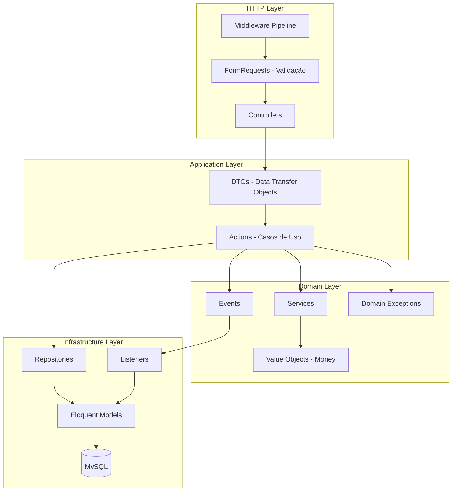

---

## Middleware Pipeline (Ordem de Execução)

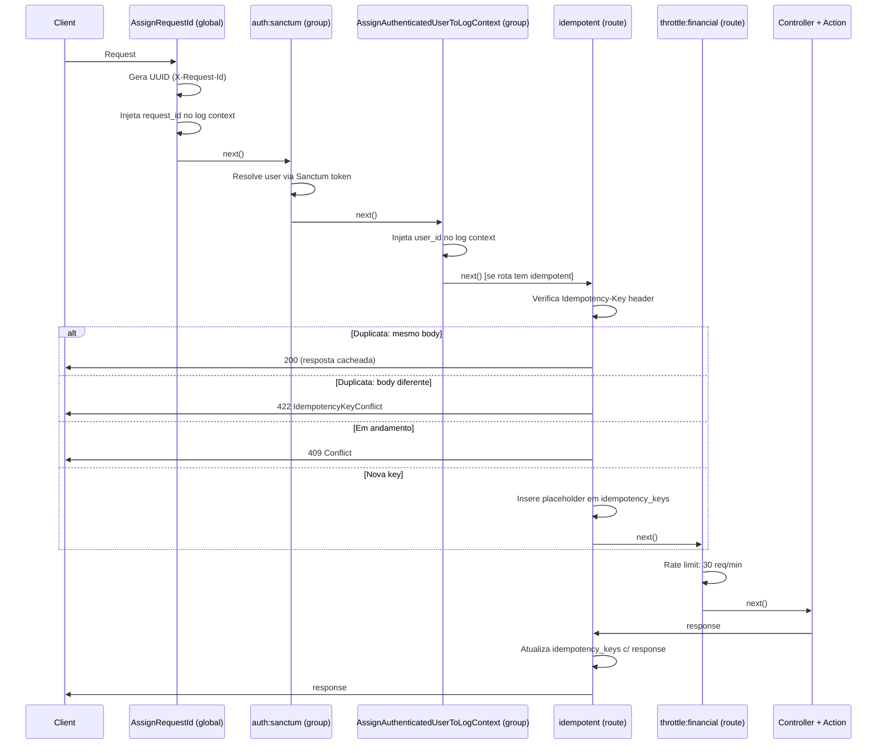

---

## Modelo de Dados (Entidades e Relacionamentos)

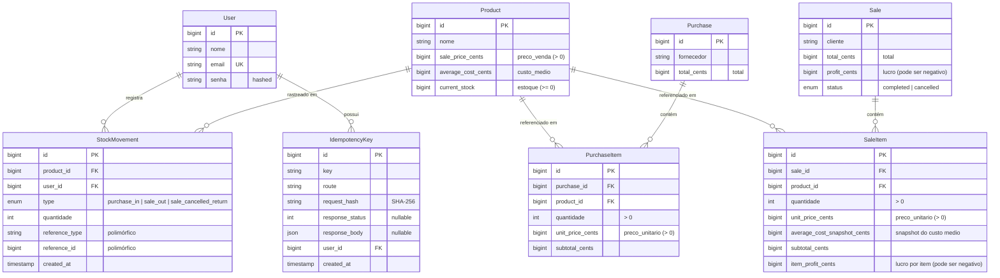

---

## Rotas da API

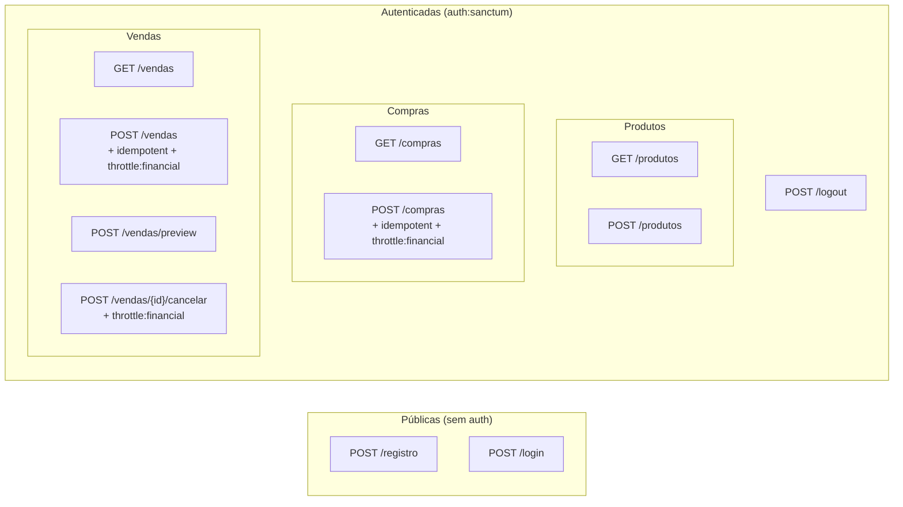

| Método | Rota | Controller | Middleware Extra |
|---|---|---|---|
| POST | `/registro` | AuthController@register | — |
| POST | `/login` | AuthController@login | — |
| POST | `/logout` | AuthController@logout | — |
| GET | `/produtos` | ProductsController@index | — |
| POST | `/produtos` | ProductsController@store | — |
| GET | `/compras` | PurchasesController@index | — |
| POST | `/compras` | PurchasesController@store | idempotent, throttle:financial |
| GET | `/vendas` | SalesController@index | — |
| POST | `/vendas` | SalesController@store | idempotent, throttle:financial |
| POST | `/vendas/preview` | SalesController@preview | — |
| POST | `/vendas/{id}/cancelar` | SalesController@cancel | throttle:financial |

---

## Fluxo: Compra (RegisterPurchaseAction)

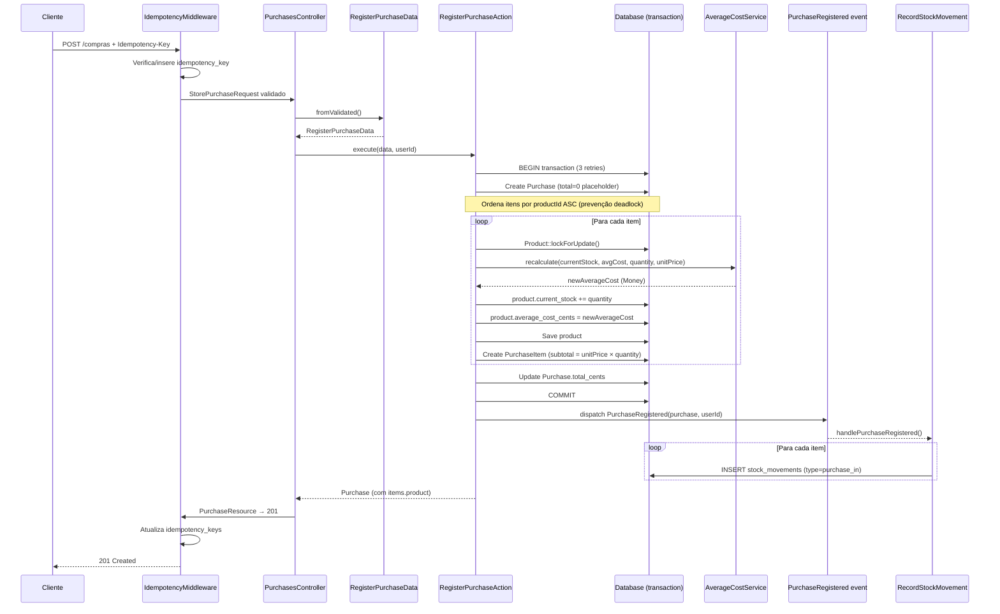

---

## Fluxo: Venda (RegisterSaleAction)

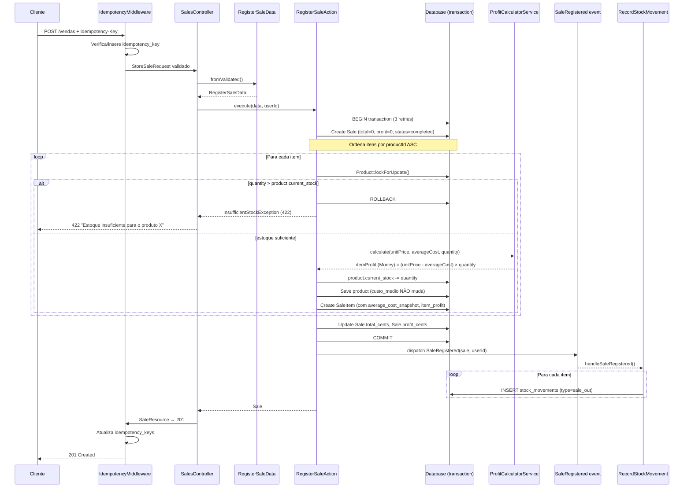

---

## Fluxo: Preview de Venda (PreviewSaleAction)

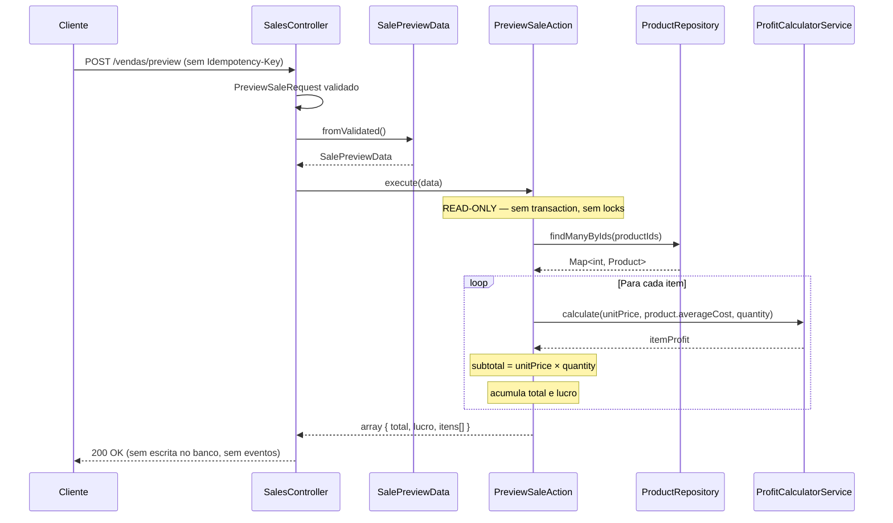

---

## Fluxo: Cancelamento de Venda (CancelSaleAction)

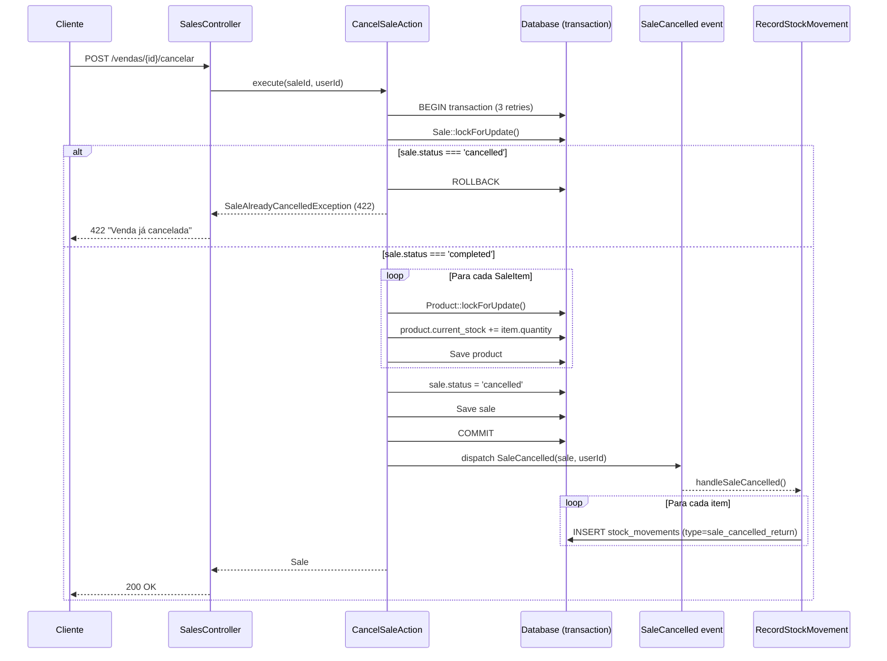

---

## Cálculo do Custo Médio

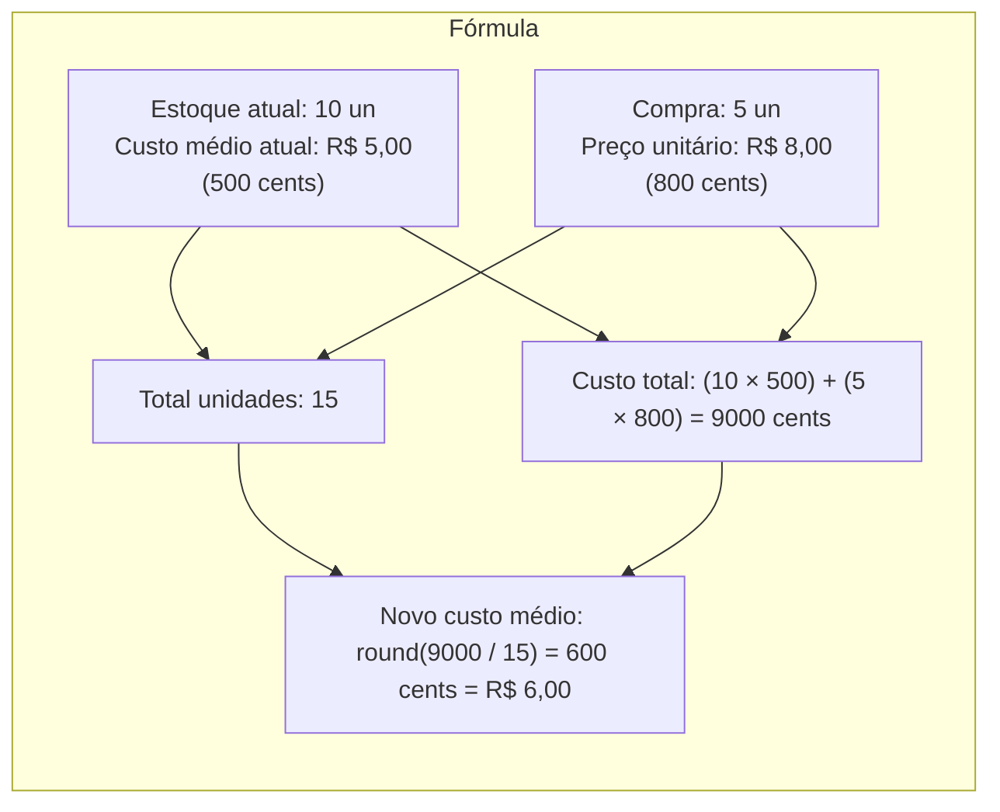

Implementação em `AverageCostService::recalculate()`: média ponderada entre estoque existente e novas unidades, arredondada para o centavo mais próximo.

---

## Cálculo do Lucro

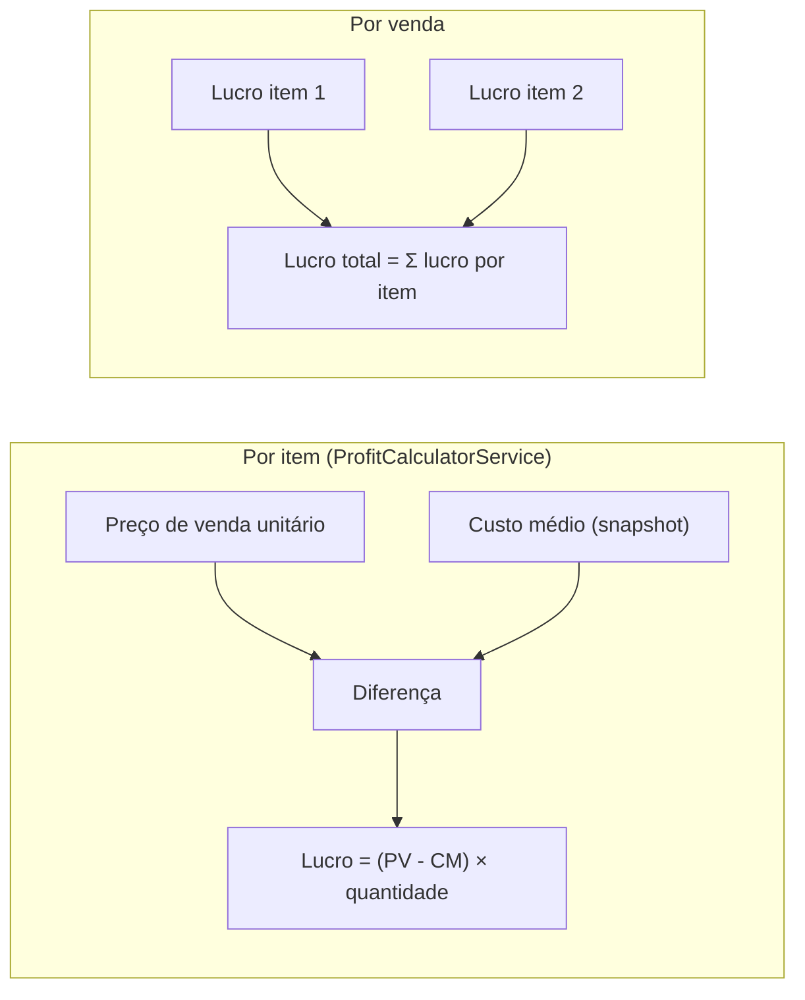

---

## Value Object: Money

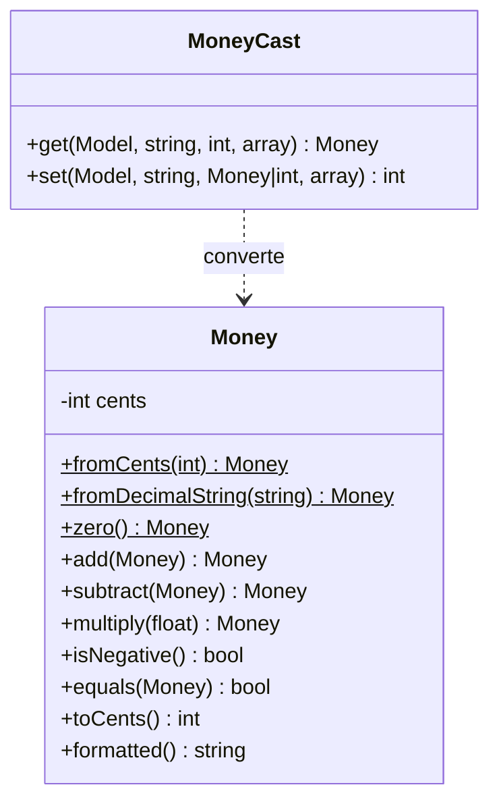

- **Interno**: centavos inteiros (`int`) — sem arredondamento de ponto flutuante
- **Fronteira HTTP**: strings decimais (`"99.90"`) via `formatted()` e `fromDecimalString()`
- **Banco de dados**: `bigint` (centavos), convertido via `MoneyCast`

---

## Sistema de Idempotência

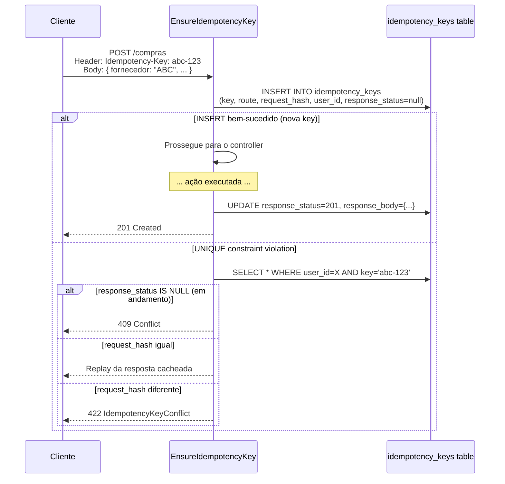

**Garantia**: mesmo `Idempotency-Key` com mesmo body → resposta idêntica. Key reutilizada com body diferente → erro. Race condition (requisição ainda em andamento) → 409.

---

## Event Sourcing (StockMovement)

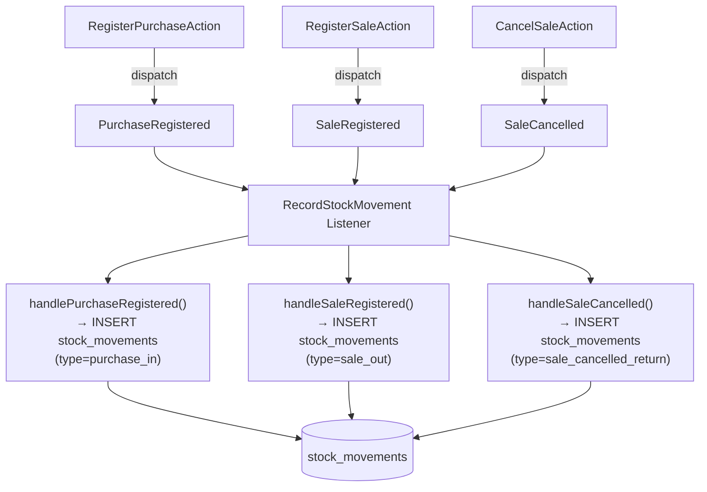

`stock_movements` é uma tabela append-only de auditoria. Cada registro contém: `product_id`, `user_id`, `type` (enum), `quantity`, e referência polimórfica (`reference_type` + `reference_id`). Nenhum registro é atualizado ou deletado.

---

## Padrão Repository

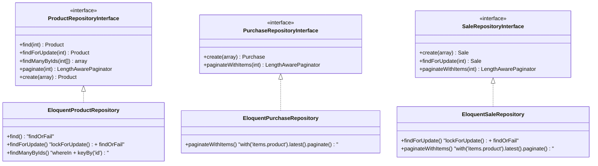

Binding no `RepositoryServiceProvider`:

```php
$this->app->bind(ProductRepositoryInterface::class, EloquentProductRepository::class);
$this->app->bind(PurchaseRepositoryInterface::class, EloquentPurchaseRepository::class);
$this->app->bind(SaleRepositoryInterface::class, EloquentSaleRepository::class);
```

---

## Estrutura de Respostas da API

### ProductResource

```json
{
  "id": 1,
  "nome": "Fone de Ouvido",
  "custo_medio": "15.00",
  "preco_venda": "29.90",
  "estoque": 42
}
```

### PurchaseResource

```json
{
  "id": 1,
  "fornecedor": "Distribuidora ABC",
  "total": "150.00",
  "produtos": [
    {
      "id": 1,
      "nome": "Fone de Ouvido",
      "quantidade": 10,
      "preco_unitario": "15.00",
      "subtotal": "150.00"
    }
  ]
}
```

### SaleResource

```json
{
  "id": 1,
  "cliente": "João Silva",
  "total": "29.90",
  "lucro": "14.90",
  "status": "completed",
  "produtos": [
    {
      "id": 1,
      "nome": "Fone de Ouvido",
      "quantidade": 1,
      "preco_unitario": "29.90",
      "subtotal": "29.90"
    }
  ]
}
```

### Preview de Venda (resposta direta, sem Resource)

```json
{
  "total": "59.80",
  "lucro": "29.80",
  "itens": [
    {
      "id": 1,
      "nome": "Fone de Ouvido",
      "quantidade": 2,
      "preco_unitario": "29.90",
      "subtotal": "59.80",
      "lucro": "29.80"
    }
  ]
}
```

---

## Exceções de Domínio

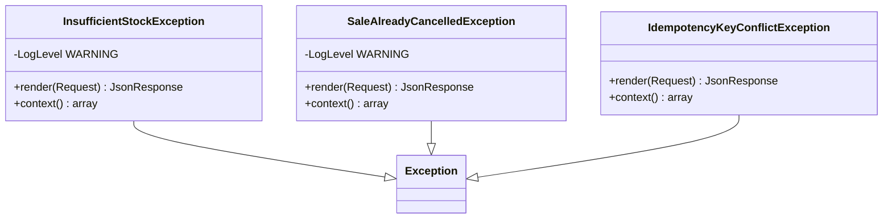

| Exceção | Gatilho | HTTP | Mensagem |
|---|---|---|---|
| `InsufficientStockException` | Venda excede `current_stock` | 422 | "Estoque insuficiente para o produto `<nome>`" |
| `SaleAlreadyCancelledException` | Cancelar venda já cancelada | 422 | "Venda já cancelada" |
| `IdempotencyKeyConflictException` | Idempotency-Key reutilizada com body diferente | 422 | "Idempotency-Key já utilizada com um corpo de requisição diferente" |

---

## Fluxo Completo de Requisição

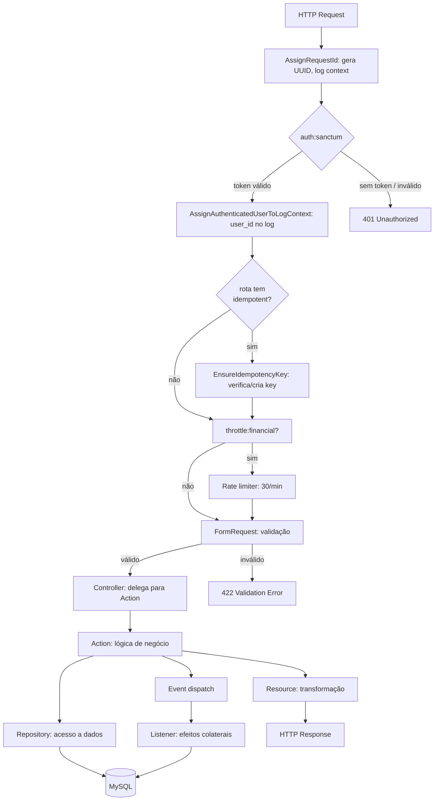
