# Arquitetura do Frontend — Fone Ninja

## Visão Geral

SPA em Vue 3 (Composition API) + TypeScript strict para ERP de estoque. Pinia para estado global, Vue Router com guard de autenticação, Axios com interceptors, Tailwind CSS v4 com tema dual (claro/escuro), componentes shadcn-vue/reka-ui, e tabelas via TanStack Table.

---

## Stack

| Componente | Tecnologia |
|---|---|
| Framework | Vue 3.5 (Composition API + `<script setup>`) |
| TypeScript | 5.9 (strict mode) |
| Roteamento | Vue Router 4.6 |
| Estado | Pinia 2.3 |
| HTTP | Axios 1.19 |
| Tabelas | @tanstack/vue-table 8.21 |
| UI Primitives | reka-ui 2.10 (sucessor do Radix Vue) |
| Estilização | Tailwind CSS 4.3 + CVA + tailwind-merge + tw-animate-css |
| Ícones | lucide-vue-next |
| Testes | Vitest 4 + @vue/test-utils + jsdom + axios-mock-adapter |
| Build | Vite 7 |
| Deploy | Docker multi-stage (node:22-alpine → nginx:1.27-alpine) |

---

## Estrutura de Diretórios

```
frontend/
├── src/
│   ├── main.ts                  # createApp, Pinia, router, style.css
│   ├── App.vue                  # Layout raiz: sidebar + header + router-view
│   ├── style.css                # Tailwind v4 + CSS variables (light/dark)
│   ├── api/
│   │   ├── http.ts              # Axios instance + interceptors + ApiError
│   │   └── http.spec.ts
│   ├── composables/
│   │   ├── useApiError.ts       # Normalização de erros → fieldErrors ou snackbar
│   │   ├── useProductForm.ts    # Formulário de criação de produto
│   │   ├── usePurchaseForm.ts   # Formulário de compra + idempotência
│   │   ├── useSaleForm.ts       # Formulário de venda + preview ao vivo
│   │   └── useTheme.ts          # Alternância tema claro/escuro
│   ├── lib/
│   │   └── utils.ts             # cn(), formatMoney(), formatQuantity()
│   ├── router/
│   │   └── index.ts             # 6 rotas + beforeEach guard
│   ├── services/
│   │   ├── authService.ts       # login, register, logout
│   │   ├── productService.ts    # list, create
│   │   ├── purchaseService.ts   # list, create (com idempotencyKey)
│   │   └── saleService.ts       # list, create, preview, cancel
│   ├── stores/
│   │   ├── auth.ts              # token + user
│   │   ├── product.ts           # items[], fetchAll, create
│   │   ├── purchase.ts          # items[], fetchAll, create
│   │   ├── sale.ts              # items[], fetchAll, create, cancel, preview
│   │   └── snackbar.ts          # visible, message, color
│   ├── types/
│   │   ├── auth.ts              # LoginPayload, RegisterPayload, AuthUser, LoginResponse
│   │   ├── product.ts           # Product, CreateProductPayload
│   │   ├── purchase.ts          # Purchase, PurchaseItem, CreatePurchasePayload, PurchaseItemPayload
│   │   └── sale.ts              # Sale, SaleItem, SaleStatus, CreateSalePayload, SalePreview, etc.
│   ├── views/
│   │   ├── LoginView.vue        # Login / registro (toggle)
│   │   ├── DashboardView.vue    # KPIs (lucro, receita, ticket medio, etc.)
│   │   ├── ProductsView.vue     # Lista + criação de produtos
│   │   ├── PurchasesView.vue    # Lista + criação de compras
│   │   └── SalesView.vue        # Lista + criação + cancelamento de vendas
│   └── components/
│       ├── AppToast.vue         # Snackbar global (teleported)
│       ├── DataTable.vue        # Tabela genérica (TanStack)
│       └── ui/                  # Primitivos shadcn-vue (reka-ui)
│           ├── badge/Badge.vue
│           ├── button/Button.vue
│           ├── card/            # Card, CardHeader, CardContent, etc.
│           ├── dialog/
│           ├── field/Field.vue
│           ├── input/Input.vue
│           ├── select/Select.vue
│           ├── sheet/           # Sheet, SheetContent, etc.
│           ├── skeleton/Skeleton.vue
│           └── table/
└── docs/
    └── arquitetura-frontend.md  # Este arquivo
```

---

## Diagrama de Camadas

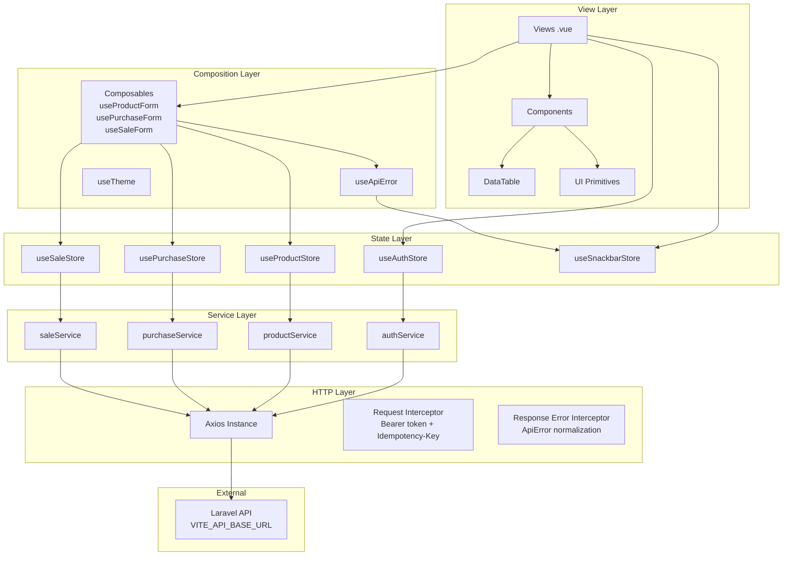

**Regra de ouro**: `View → Composable → Store → Service → HTTP → API`. Nenhuma View chama Service diretamente. Nenhum Store chama Axios diretamente.

---

## Roteamento

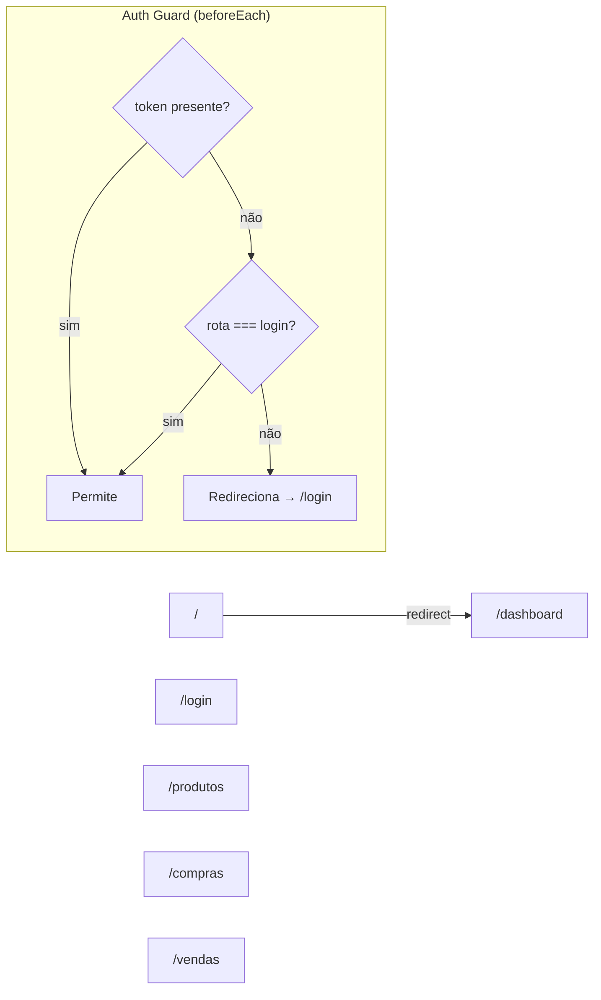

| Path | Nome | View | Lazy Load |
|---|---|---|---|
| `/login` | `login` | `LoginView.vue` | Sim |
| `/dashboard` | `dashboard` | `DashboardView.vue` | Sim |
| `/produtos` | `produtos` | `ProductsView.vue` | Sim |
| `/compras` | `compras` | `PurchasesView.vue` | Sim |
| `/vendas` | `vendas` | `SalesView.vue` | Sim |
| `/` | — | redirect → `/dashboard` | — |

- **Sem rotas aninhadas**. Rotas planas com `createWebHistory()`.
- **Guarda único**: `beforeEach` global — qualquer rota exceto `login` exige token. Sem metadados por rota.

---

## Fluxo de Autenticação

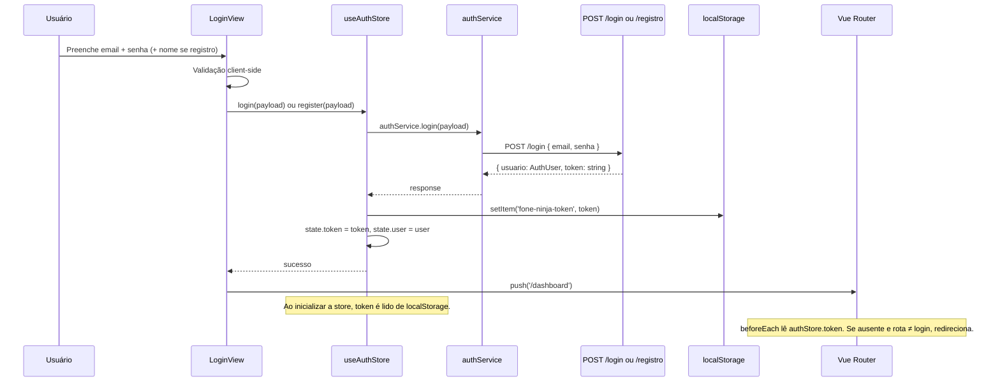

### Logout

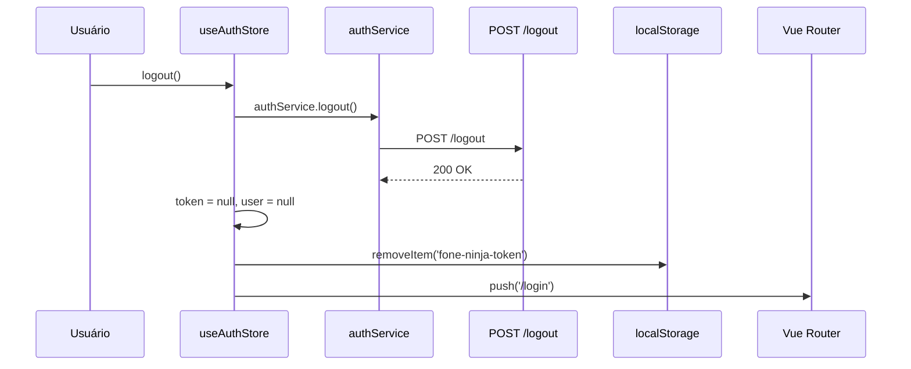

---

## Estado Global (Pinia Stores)

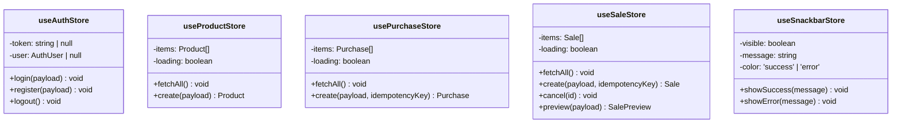

| Store | Persistência | Gatilhos de Recarga |
|---|---|---|
| `auth` | `localStorage('fone-ninja-token')` | Nunca recarregado automaticamente |
| `product` | Apenas memória | `fetchAll()` ao montar views; após criar produto ou após compra/venda com sucesso |
| `purchase` | Apenas memória | `fetchAll()` ao montar PurchasesView |
| `sale` | Apenas memória | `fetchAll()` ao montar SalesView e DashboardView |
| `snackbar` | Apenas memória | Auto-hide após 4s via AppToast.vue |

---

## HTTP Layer (Axios)

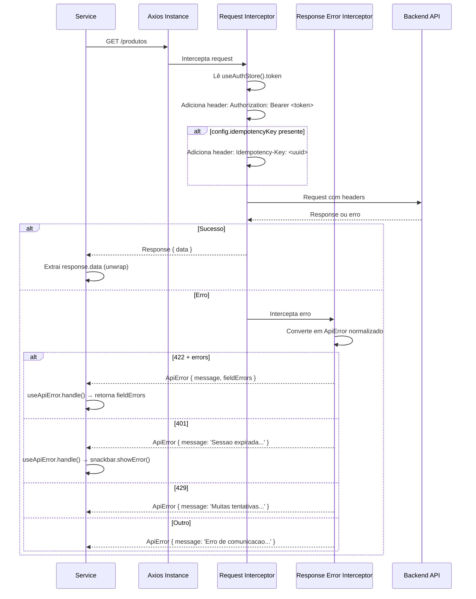

### Configuração

```typescript
// src/api/http.ts
const http = axios.create({
  baseURL: import.meta.env.VITE_API_BASE_URL, // "http://localhost/api" ou "/api"
})
```

- **Dev**: `VITE_API_BASE_URL=http://localhost/api` (Vite proxy ou CORS)
- **Prod (Docker)**: `VITE_API_BASE_URL=/api` (nginx reverse-proxy `proxy_pass http://backend:80`)

---

## Pipeline de Erro

```mermaid
graph TD
    ERR[Erro HTTP] --> AXIOS[Axios Response Error Interceptor]
    AXIOS --> NORM[Normaliza → ApiError]
    NORM --> COMP{Composable catch}
    COMP -->|fieldErrors presente| FIELD[Merge nos erros do formulário]
    COMP -->|sem fieldErrors| SNACK[snackbar.showError(message)]
    FIELD --> FORM[Exibe erros inline nos campos]
    SNACK --> TOAST[AppToast: exibe snackbar 4s]
```

---

## Estrutura de Tipos

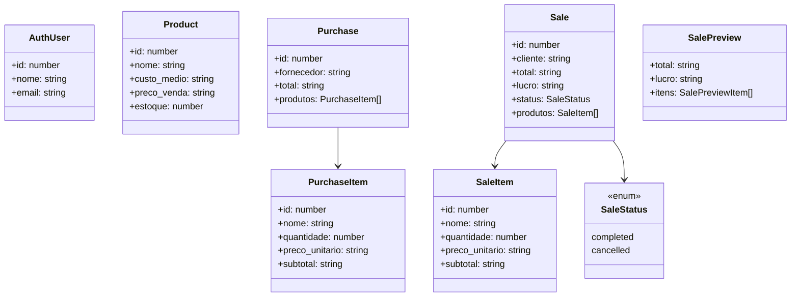

---

## Componentes Compartilhados

### DataTable (TanStack Table)

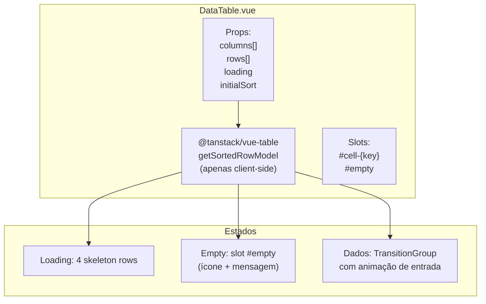

- **Ordenação**: 3 ciclos (none → asc → desc → none)
- **Colunas**: `{ key, title, align, sortable, className }`
- **Layout responsivo**: via Tailwind breakpoints nos slots de célula

### AppToast (Snackbar Global)

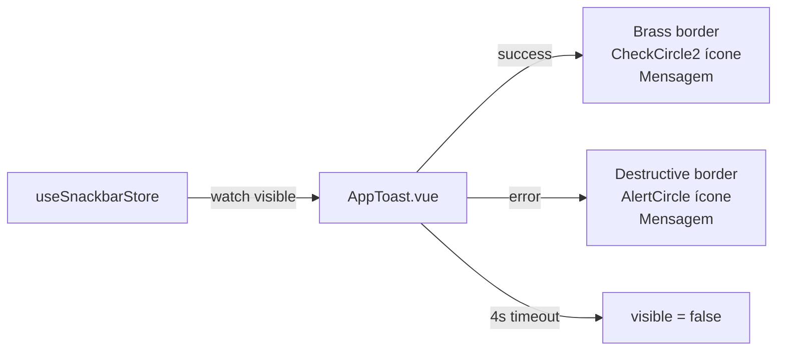

- Teleported para `<body>` via `<Teleport to="body">`
- Posição: `fixed bottom-4 right-4`
- Animações: `<Transition>` com Tailwind `animate-in/out`

---

## Padrão de Formulários

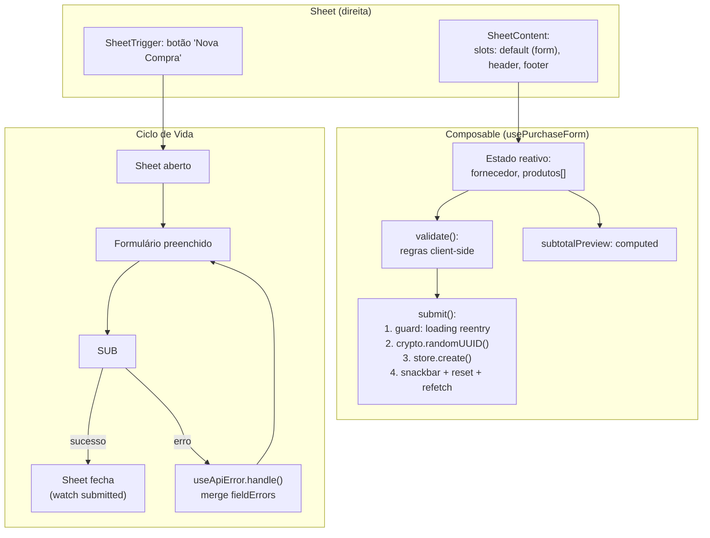

**Padrão consistente** nos 3 formulários de criação (Produto, Compra, Venda):

1. Sheet abre à direita
2. Formulário com validação client-side
3. Submit gera UUID idempotente + chama store action
4. Sucesso → snackbar verde + fecha sheet + refetch
5. Erro → fieldErrors nos campos ou snackbar vermelha

### Preview de Venda (Ao Vivo)

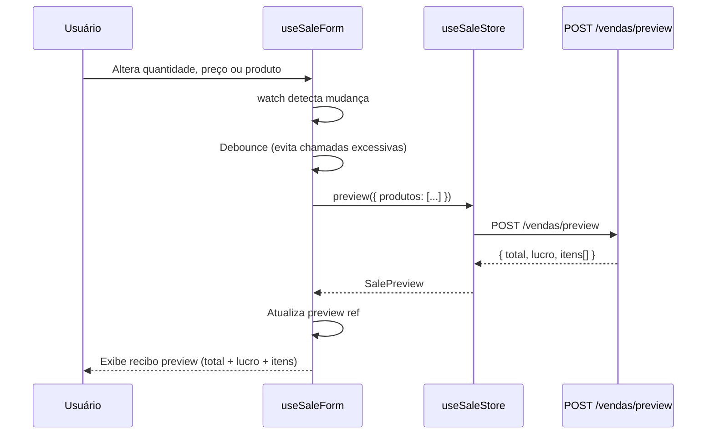

---

## Dashboard — KPIs

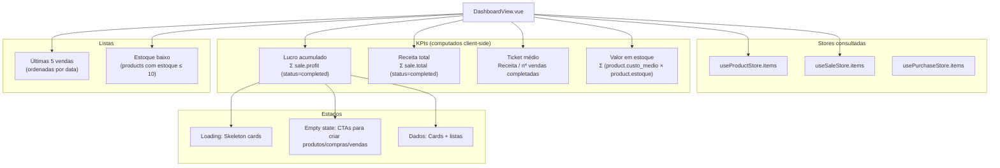

---

## Sistema de Temas (Claro/Escuro)

```mermaid
graph TD
    INIT["App.vue onMounted"] --> THEME["useTheme().initTheme()"]

    THEME --> CHECK{"localStorage<br/>('fone-ninja-theme')"}
    CHECK -->|"presente: 'dark'|'light'"| APPLY[apply(dark)]
    CHECK -->|ausente| MEDIA["matchMedia<br/>('prefers-color-scheme: dark')"]
    MEDIA --> APPLY

    TOGGLE["Usuário clica toggle"] --> FLIP["dark = !dark"]
    FLIP --> SAVE["localStorage.setItem"]
    SAVE --> APPLY

    APPLY --> DOM["document.documentElement<br/>.classList.add/remove('dark')"]
    DOM --> CSS["CSS variables alternam<br/>:root ↔ .dark"]
```

- Estado singleton em module-level (compartilhado entre instâncias do composable)
- Respeita `prefers-reduced-motion` e `prefers-reduced-transparency`

---

## Tema Visual (Design Tokens)

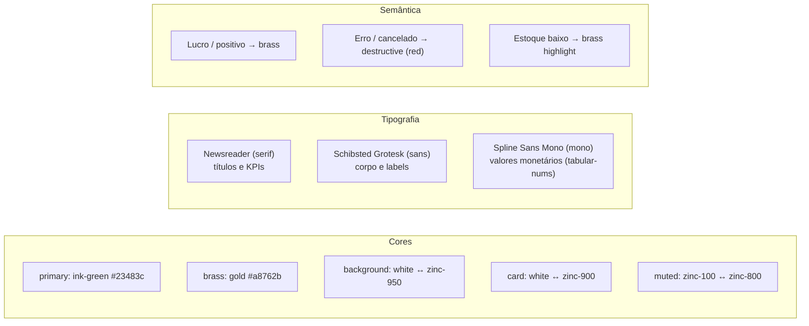

---

## Docker / Deploy

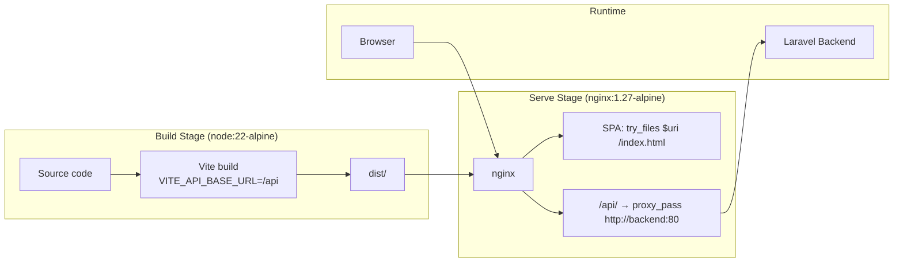

---

## Testes

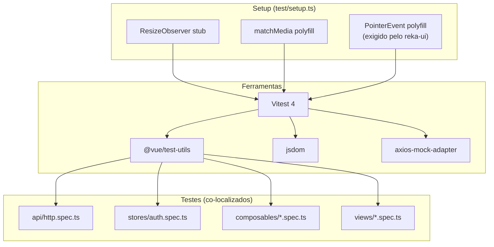

- Testes co-localizados com código fonte (`*.spec.ts` ao lado do `.ts`)
- Mock de HTTP via `axios-mock-adapter` na fronteira do serviço
- Componentes testados com `@vue/test-utils` + jsdom

---

## Convenções e Padrões

| Padrão | Descrição |
|---|---|
| **Layering estrito** | View → Composable → Store → Service → HTTP. Sem atalhos. |
| **Composition API** | `<script setup lang="ts">` em todos os componentes |
| **TypeScript strict** | Sem `any` implícito. Tipos em `src/types/` |
| **Idempotência** | `crypto.randomUUID()` por tentativa de submit. Guard `if (loading.value) return` |
| **Money formatting** | `formatMoney()` em `lib/utils.ts`: centavos → `"R$ 1.234,56"` |
| **Sheets para criação** | Formulários de criação em Sheet lateral direita, não em rotas separadas |
| **Client-side sort** | Apenas ordenação client-side via TanStack Table |
| **Snackbar único** | Um AppToast global, não toasts por componente |
| **Lazy loading** | Todas as views com `() => import(...)`, code-splitting automático |
| **Sem meta frameworks** | Sem Nuxt, sem SSR — SPA pura servida por nginx |
