# Decisões Estruturais — Backend

Registro das decisões arquiteturais do backend, contexto em que foram tomadas e justificativa. Formato inspirado em ADR (Architecture Decision Records).

---

## Índice

1. [Laravel 13 como framework](#1-laravel-13-como-framework)
2. [PHP 8.4 como versão mínima](#2-php-84-como-versão-mínima)
3. [Sanctum token-based auth (sem OAuth/JWT)](#3-sanctum-token-based-auth-sem-oauthjwt)
4. [Money como Value Object (centavos inteiros)](#4-money-como-value-object-centavos-inteiros)
5. [Padrão Action (casos de uso)](#5-padrão-action-casos-de-uso)
6. [Repository Pattern com interfaces](#6-repository-pattern-com-interfaces)
7. [DTOs imutáveis com fromValidated](#7-dtos-imutáveis-com-fromvalidated)
8. [Idempotência via middleware + tabela](#8-idempotência-via-middleware--tabela)
9. [Event-driven StockMovement (auditoria append-only)](#9-event-driven-stockmovement-auditoria-append-only)
10. [Lock pessimista (lockForUpdate)](#10-lock-pessimista-lockforupdate)
11. [DB::transaction com 3 retries](#11-dbtransaction-com-3-retries)
12. [FormRequests (não validação inline nos controllers)](#12-formrequests-não-validação-inline-nos-controllers)
13. [Services pequenos e focados (não Services monolíticos)](#13-services-pequenos-e-focados-não-services-monolíticos)
14. [Pest (não PHPUnit puro) para testes](#14-pest-não-phpunit-puro-para-testes)
15. [Português na fronteira HTTP, inglês internamente](#15-português-na-fronteira-http-inglês-internamente)
16. [Docs unificada na raiz (não por módulo)](#16-docs-unificada-na-raiz-não-por-módulo)

---

## 1. Laravel 13 como framework

**Decisão**: Usar Laravel 13 como framework da API.

**Alternativas consideradas**: Symfony, Slim, AdonisJS, FastAPI.

**Contexto**: ERP de estoque single-context — CRUD com regras de negócio de média complexidade (cálculo de custo médio, controle de estoque, idempotência). Time pequeno, necessidade de entregar rápido.

**Por que Laravel**:
- Ecossistema completo built-in: migrations, queues, events, validation, middleware pipeline, logging
- Sanctum para autenticação token-based sem complexidade de OAuth
- FormRequests nativos com mensagens de erro estruturadas (usados pelo frontend para fieldErrors)
- PHP é a linguagem com maior familiaridade do time
- Laravel 13 é a versão estável mais recente com suporte de longo prazo

**Trade-offs aceitos**: Overhead de framework para um domínio relativamente simples. Compensado pela velocidade de desenvolvimento.

---

## 2. PHP 8.4 como versão mínima

**Decisão**: Exigir PHP 8.4 no `composer.json`.

**Alternativas consideradas**: PHP 8.2, PHP 8.3.

**Contexto**: `composer.json` declara `"php": "^8.4"`. Não há legado para manter compatibilidade.

**Por que 8.4**:
- Property hooks (embora não usados diretamente, habilitam refactors futuros)
- Assymetric visibility (`public private(set)`) para DTOs
- Melhorias de performance no engine
- Laravel 13 recomenda 8.4 como mínimo

**Trade-offs aceitos**: Disponibilidade em ambientes de hospedagem — resolvido com Docker.

---

## 3. Sanctum token-based auth (sem OAuth/JWT)

**Decisão**: Laravel Sanctum para autenticação por token simples.

**Alternativas consideradas**: Passport (OAuth2), tymon/jwt-auth, Firebase Auth.

**Contexto**: API consumida exclusivamente pela SPA interna. Sem third-party clients, sem OAuth scopes, sem integração social.

**Por que Sanctum**:
- Token simples: `POST /login` → `{ token }` → `Authorization: Bearer <token>`
- Zero configuração de OAuth (sem clients, scopes, grants)
- Armazenamento em `personal_access_tokens` nativo do Laravel
- Suporte a revogação individual de tokens
- Middleware `auth:sanctum` já integrado ao pipeline

**Por que não Passport**: Adicionaria complexidade de OAuth2 desnecessária — sem múltiplos clients, sem autorização delegada.

**Por que não JWT puro**: Sanctum já resolve token creation/revocation/validation. JWT exigiria implementar refresh tokens, blacklist, e rotação manualmente.

**Trade-offs aceitos**: Sem expiração configurável por token (tokens não expiram por padrão). Aceitável para aplicação interna.

---

## 4. Money como Value Object (centavos inteiros)

**Decisão**: Representar todos os valores monetários como centavos inteiros (`int`) encapsulados em um Value Object `Money` imutável, com `MoneyCast` para tradução Eloquent ↔ VO.

**Alternativas consideradas**: `float`/`double`, `decimal` via `bcmath`, string formatada no banco.

**Contexto**: ERP financeiro — cálculos de custo médio, lucro, totais. Precisão de centavo é crítica. Múltiplas operações (soma, subtração, multiplicação) em transações.

**Por que centavos inteiros**:
- Aritmética de inteiros é exata — sem erros de ponto flutuante
- `0.1 + 0.2 !== 0.3` não acontece com inteiros
- `bigint` no MySQL armazena centavos sem perda até valores muito altos
- `Money` VO é imutável — cada operação retorna nova instância, sem efeitos colaterais
- `MoneyCast` traduz automaticamente na camada Eloquent — controllers e actions nunca lidam com centavos crus

**Por que não float**: Imprecisão inerente do IEEE 754. `round()` não resolve todos os casos para operações financeiras encadeadas.

**Por que não bcmath**: Adicionaria dependência e verbosidade (`bcadd`, `bcmul`). Inteiros resolvem com operadores nativos.

**Trade-offs aceitos**: Divisão com arredondamento (`round()`) pode perder fração de centavo. Média ponderada do custo médio usa `round()` — erro máximo de ±0.5 centavos, diluído no volume.

---

## 5. Padrão Action (casos de uso)

**Decisão**: Cada operação de negócio é uma classe Action dedicada (ex: `RegisterPurchaseAction`), isolada de controllers.

**Alternativas consideradas**: Lógica nos Controllers, Service Layer monolítica, Commands/Handlers (CQRS).

**Contexto**: Operações de negócio bem definidas (registrar compra, registrar venda, cancelar venda, preview). Cada uma tem fluxo próprio com locks, cálculos, eventos e transações.

**Por que Actions**:
- Single Responsibility: cada classe faz UMA operação
- Controllers viram orquestradores finos (validar → DTO → action → resource)
- Testabilidade: testa a action isoladamente com stubs de repository
- Evita "god services" que acumulam métodos desconexos
- Nomeação explícita: `RegisterPurchaseAction` deixa claro o que a classe faz

**Por que não CQRS**: Complexidade desnecessária para o tamanho do domínio. Sem necessidade de separar comandos e queries para 4 operações.

**Por que não Service monolítico**: `PurchaseService` cresceria com `create`, `update`, `delete`, `list` e lógica de negócio misturada. Actions evitam acoplamento.

**Trade-offs aceitos**: Mais arquivos (uma classe por operação). Compensado por clareza e testabilidade.

---

## 6. Repository Pattern com interfaces

**Decisão**: Interfaces de repositório (`ProductRepositoryInterface`) com implementações Eloquent, bindings no `RepositoryServiceProvider`.

**Alternativas consideradas**: Acesso direto a Models nos Actions, Repository sem interface.

**Contexto**: Ações precisam acessar dados com queries específicas (lock pessimista, busca por array de IDs, paginação com relacionamentos).

**Por que Repository Pattern**:
- Encapsula queries complexas (`lockForUpdate`, `findManyByIds`) longe dos Actions
- Interface permite mock/stub nos testes unitários
- Facilita troca de implementação (ex: caching layer intermediário) sem alterar Actions
- `RepositoryServiceProvider` centraliza bindings — fácil de inspecionar

**Por que não acesso direto**: `Product::lockForUpdate()` no meio de um Action acopla o caso de uso ao Eloquent. Testar exigiria banco real ou mocks complexos.

**Trade-offs aceitos**: Camada extra de indireção. Para 3 entidades com CRUD simples, o overhead é mínimo.

---

## 7. DTOs imutáveis com fromValidated

**Decisão**: Data Transfer Objects como `final class` com propriedades tipadas e factory method `fromValidated(array)`.

**Alternativas consideradas**: Arrays associativos, objetos `stdClass`, Spatie Data.

**Contexto**: Dados cruzam a fronteira FormRequest → Controller → Action. Precisa de contrato tipado entre camadas.

**Por que DTOs próprios**:
- `fromValidated()` recebe o array já validado do FormRequest — garantia de tipo em runtime
- `final class` impede herança acidental
- Propriedades tipadas (`int`, `string`, `Money`, `array`) dão segurança estática
- Sem dependência externa — 5 DTOs pequenos

**Por que não Spatie Data**: Adicionaria dependência para funcionalidade que 5 classes simples resolvem. Overkill.

**Por que não arrays**: `$data['fornecedor']` não tem autocomplete, não tem garantia de tipagem. Erro de digitação em chave de array só aparece em runtime.

**Trade-offs aceitos**: Mais código boilerplate (cada DTO repete `fromValidated`). Aceitável pelo ganho de segurança.

---

## 8. Idempotência via middleware + tabela

**Decisão**: Middleware `EnsureIdempotencyKey` que persiste estado em tabela `idempotency_keys` com `UNIQUE(user_id, key)`.

**Alternativas consideradas**: Cache (Redis), built-in Laravel rate limiter, idempotência no client apenas.

**Contexto**: `POST /compras` e `POST /vendas` são operações financeiras que não podem ser duplicadas. Cliente pode retentar após timeout de rede.

**Por que tabela no banco**:
- Atomicidade via `UNIQUE` constraint — impossível inserir duplicata
- Persistência entre deploys/restarts (cache Redis evapora)
- Inserção do placeholder ANTES da ação, update do response DEPOIS — cobre race condition
- Hash SHA-256 do body detecta reuso malicioso da key com body diferente
- Sem dependência de infraestrutura extra (Redis)

**Por que não cache**: Se o cache for limpo entre deploys, keys idempotentes seriam perdidas e operações duplicadas passariam.

**Por que não só client-side**: Cliente pode perder o estado (refresh, crash, aba duplicada). Backend é a fonte da verdade.

**Trade-offs aceitos**: Linha extra no banco por requisição idempotente. Tabela cresce linearmente. Resolvido com TTL futuro (ex: cleanup de keys > 30 dias).

---

## 9. Event-driven StockMovement (auditoria append-only)

**Decisão**: `stock_movements` como tabela append-only, populada por listener `RecordStockMovement` que reage a 3 eventos (`PurchaseRegistered`, `SaleRegistered`, `SaleCancelled`).

**Alternativas consideradas**: Registrar movimentação inline no Action, trigger no banco, sem auditoria.

**Contexto**: Necessário rastrear toda alteração de estoque — quem, quando, qual produto, qual operação, qual referência.

**Por que Event-driven**:
- Desacopla a ação principal da auditoria — Action não sabe que stock_movements existe
- Append-only garante integridade histórica (nada é atualizado ou deletado)
- Fácil adicionar novos listeners (ex: notificação de estoque baixo) sem alterar Actions
- Referência polimórfica (`reference_type` + `reference_id`) conecta ao registro origem

**Por que não inline**: Poluiria Actions com `StockMovement::create(...)`. Ação de negócio ficaria com múltiplas responsabilidades.

**Por que não trigger MySQL**: Lógica de aplicação no banco dificulta testes, debug e versionamento com migrations.

**Trade-offs aceitos**: Evento síncrono (não usa queue) — se listener falhar, a transação inteira faz rollback. Isso é desejado (consistência forte entre operação e auditoria).

---

## 10. Lock pessimista (lockForUpdate)

**Decisão**: Usar `SELECT ... FOR UPDATE` em todas as operações que alteram produto (compra, venda, cancelamento).

**Alternativas consideradas**: Lock otimista (version column), sem lock (race condition), transação serializável.

**Contexto**: Concorrência em operações de estoque — duas vendas simultâneas do mesmo produto podem causar estoque negativo se não houver lock.

**Por que lock pessimista**:
- Garantia forte: enquanto uma transação lê/altera estoque, outras esperam
- Previne venda de estoque que outra transação já reservou mas ainda não comitou
- Deadlock prevenido ordenando itens por `productId` ASC
- Simples de implementar: `lockForUpdate()` no Eloquent

**Por que não lock otimista**: Exigiria retry no client (tentar de novo se `version` mudou). Pior UX — usuário preenche formulário e recebe erro de concorrência.

**Por que não sem lock**: Race condition permitiria estoque negativo se duas vendas lessem o mesmo `current_stock = 5` antes de qualquer uma debitar.

**Trade-offs aceitos**: Transações concorrentes no mesmo produto esperam (bloqueio). Para ERP de varejo pequeno com baixa concorrência, o impacto é desprezível.

---

## 11. DB::transaction com 3 retries

**Decisão**: Todas as ações financeiras usam `DB::transaction(fn, 3)` — 3 tentativas em caso de deadlock.

**Alternativas consideradas**: 1 tentativa (sem retry), retry infinito, retry no client.

**Contexto**: MySQL pode detectar deadlock entre transações concorrentes e matar uma delas. Retry resolve sem expor erro ao usuário.

**Por que 3 retries**:
- Deadlocks são raros (ordenação por productId ASC previne a maioria)
- 3 tentativas cobrem o caso de 2+ transações colidirem
- Após 3 falhas, o erro é real (não é deadlock transitório) — expor ao usuário é correto
- Custo é baixo: retry só ocorre se MySQL lançar `DeadlockException`

**Por que não retry infinito**: Loop infinito se houver bug que cause deadlock determinístico.

**Por que não retry no client**: Client precisaria saber distinguir deadlock de erro de validação. Backend sabe o que é recuperável.

**Trade-offs aceitos**: Em raros casos de deadlock real, o 4º erro chega ao usuário como 500. Aceitável.

---

## 12. FormRequests (não validação inline nos controllers)

**Decisão**: Validação de entrada via classes `FormRequest` dedicadas (ex: `StorePurchaseRequest`).

**Alternativas consideradas**: Validação inline com `$request->validate()`, validação nos Actions, validação no frontend apenas.

**Contexto**: API recebe payloads com regras de validação bem definidas — campos obrigatórios, tipos, restrições de valor, existência de FK.

**Por que FormRequests**:
- Separa validação do controller — controller só recebe dados garantidamente válidos
- Regras declarativas e legíveis (`required|string|min:3`)
- `distinct` para arrays previne duplicatas de produto na mesma requisição
- Erro de validação retorna 422 com `errors` estruturado → frontend usa como `fieldErrors`
- Reutilização: `authorize()` pode ter lógica de autorização por request

**Por que não validação inline**: Controller ficaria com `$request->validate([...50 linhas...])` poluindo o método.

**Por que não só frontend**: Validação client-side é UX, não segurança. Backend sempre valida.

**Trade-offs aceitos**: Uma classe extra por endpoint. 6 classes de validação para 6 endpoints — overhead mínimo.

---

## 13. Services pequenos e focados (não Services monolíticos)

**Decisão**: Separar lógica de cálculo em serviços especializados — `AverageCostService` (média ponderada) e `ProfitCalculatorService` (lucro por item).

**Alternativas consideradas**: Métodos privados nos Actions, service único `FinancialCalculatorService`, funções helper.

**Contexto**: Duas fórmulas matemáticas usadas em múltiplos Actions (compra recalcula custo, venda e preview calculam lucro).

**Por que serviços separados**:
- Cada serviço tem UMA responsabilidade (custo médio OU lucro)
- Reutilizados em Actions diferentes sem duplicação
- Testáveis em isolamento (teste unitário puro, sem banco)
- Fáceis de modificar — alterar fórmula de lucro não mexe no serviço de custo médio

**Por que não métodos privados**: Duplicaria a fórmula nos Actions (`RegisterPurchaseAction` e `CancelSaleAction` não usam lucro, mas `RegisterSaleAction` e `PreviewSaleAction` usam).

**Por que não service monolítico**: `FinancialCalculatorService` com `recalculateAverageCost` e `calculateProfit` mistura responsabilidades. Método adicional (ex: margem percentual) inflaria a classe.

**Trade-offs aceitos**: Duas classes para duas fórmulas. Clareza supera a economia de arquivos.

---

## 14. Pest (não PHPUnit puro) para testes

**Decisão**: Pest 4 como test runner, sobre PHPUnit 12.

**Alternativas consideradas**: PHPUnit puro, Codeception, PHPSpec.

**Contexto**: Testes unitários e de feature para Actions, Services, Models, Listeners e endpoints HTTP.

**Por que Pest**:
- Sintaxe mais concisa — `it()`, `expect()`, closures
- Plugin Laravel oficial (Pest Laravel) com helpers para HTTP tests, database assertions
- `dataset()` para testar múltiplos cenários sem loops manuais
- PHPUnit é o engine subjacente — compatibilidade total com assertions e mocks do PHPUnit

**Por que não PHPUnit puro**: Mais verboso — `$this->assertTrue()` vs `expect()->toBeTrue()`. Pest reduz boilerplate em ~30%.

**Trade-offs aceitos**: Mais uma dependência de dev. Leve e com suporte ativo do ecossistema Laravel.

---

## 15. Português na fronteira HTTP, inglês internamente

**Decisão**: Campos da API e mensagens de erro em português (`fornecedor`, `cliente`, `preco_unitario`, "Estoque insuficiente"). Código, classes, métodos e comentários em inglês.

**Alternativas consideradas**: API toda em inglês, API toda em português, tradução no client.

**Contexto**: ERP para varejista brasileiro. Usuário final vê a aplicação em português. Time de desenvolvimento lê/escreve código em inglês.

**Por que fronteira em português**:
- Campos da API casam 1:1 com formulários do frontend
- Mensagens de erro chegam prontas para exibição (frontend não traduz)
- `fieldErrors` do Laravel usam os nomes dos campos da request (em português)

**Por que código em inglês**:
- Padrão da indústria — bibliotecas, documentação, Stack Overflow
- Classes como `RegisterPurchaseAction` comunicam intenção universalmente
- Facilita contribuições e manutenção por qualquer dev

**Trade-offs aceitos**: Troca de contexto mental entre idiomas. Mitigado pela clara separação: tudo que toca HTTP é português, resto é inglês.

---

## 16. Docs unificada na raiz (não por módulo)

**Decisão**: Pasta única `docs/` na raiz do projeto com documentação de negócio, backend e frontend.

**Alternativas consideradas**: `backend/docs/` + `frontend/docs/` separados, wiki no GitHub, Notion.

**Contexto**: Projeto mono-repo com backend e frontend no mesmo repositório. Documentação serve ambos.

**Por que docs/ na raiz**:
- Única fonte da verdade para regras de negócio (válidas para back e front)
- Facilita navegação — tudo em um lugar, sem alternar entre pastas
- Versionada junto com o código (git) — documentação e código sempre sincronizados
- Markdown renderiza nativamente no GitHub/GitLab

**Por que não separado por módulo**: Regras de negócio são cross-cutting. Separar `backend/docs/regras.md` e `frontend/docs/regras.md` geraria duplicação ou inconsistência.

**Por que não Notion/wiki**: Desacopla documentação do código. Risco de ficar desatualizada. Sem code review de documentação.

**Trade-offs aceitos**: Arquivos maiores (~800 linhas cada). Melhor que fragmentação.

---

## Resumo Visual

```mermaid
graph TB
    L13[Laravel 13]
    PHP84[PHP 8.4]
    SANCTUM[Sanctum Tokens]
    MONEY[Money VO - centavos]
    ACTIONS[Action Classes]
    REPOS[Repository Pattern]
    DTO[DTOs imutáveis]
    IDEMP[Idempotência DB]
    EVENTS[Event-driven Audit]
    LOCK[Pessimistic Lock]
    RETRY[3 Retries]
    FORMREQ[FormRequests]
    SMALLSVC[Small Services]
    PEST[Pest Tests]
    PT_BR[Português HTTP / Inglês código]
    DOCS[Docs/ raiz unificada]
```

