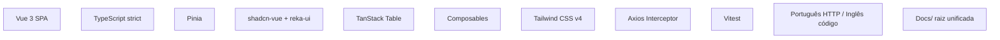

# Decisões Estruturais — Frontend

Registro das decisões arquiteturais do frontend, contexto em que foram tomadas e justificativa. Formato inspirado em ADR (Architecture Decision Records).

---

## Índice

1. [TypeScript strict mode](#1-typescript-strict-mode)
2. [Pinia (não Vuex) para estado global](#2-pinia-não-vuex-para-estado-global)
3. [shadcn-vue / reka-ui (não Vuetify/PrimeVue)](#3-shadcn-vue--reka-ui-não-vuetifyprimevue)
4. [TanStack Table (não tabela customizada)](#4-tanstack-table-não-tabela-customizada)
5. [Composables como camada intermediária](#5-composables-como-camada-intermediária)
6. [Tailwind CSS v4 (não CSS Modules/SCSS)](#6-tailwind-css-v4-não-css-modulesscss)
7. [Axios com interceptor único de erro (não try/catch por chamada)](#7-axios-com-interceptor-único-de-erro-não-trycatch-por-chamada)
8. [Vitest (não Jest) para testes](#8-vitest-não-jest-para-testes)
9. [Português na fronteira HTTP, inglês internamente](#9-português-na-fronteira-http-inglês-internamente)
10. [Docs unificada na raiz (não por módulo)](#10-docs-unificada-na-raiz-não-por-módulo)

---

## 1. TypeScript strict mode

**Decisão**: `tsconfig.json` com `"strict": true`.

**Alternativas consideradas**: JavaScript puro, TypeScript não-estrito.

**Contexto**: Projeto novo, sem migração de JS. Tipo de dados do domínio bem definido (produtos, compras, vendas, valores monetários).

**Por que strict**:
- Tipos do domínio financeiro exigem precisão (centavos, lucro, total)
- `strict: true` evita `null`/`undefined` acidentais em valores monetários
- Melhor DX com autocomplete e refactoring seguro
- Serve como documentação viva das estruturas de dados

**Trade-offs aceitos**: Mais código de tipo (interfaces, generics), curva de aprendizado para devs sem experiência em TS. Compensado por menos bugs em runtime.

---

## 2. Pinia (não Vuex) para estado global

**Decisão**: Pinia 2.3 como biblioteca de estado.

**Alternativas consideradas**: Vuex 4, reactive() manual, provide/inject.

**Contexto**: 5 stores (auth, product, purchase, sale, snackbar). Estado simples — arrays, loading booleans, token string.

**Por que Pinia**:
- API mais simples que Vuex — sem mutations, sem `commit`/`dispatch`
- TypeScript first-class — tipagem inferida automaticamente
- Devtools integrados com Vue Devtools
- Composables podem consumir stores diretamente com `useXxxStore()`
- Oficialmente recomendado pelo time Vue para novos projetos

**Por que não Vuex**: Vuex 4 é funcional mas verboso — requer mutations mesmo para setters simples. Pinia é a evolução natural.

**Por que não reactive() manual**: Perderia devtools, hot-reload de estado, e convenção padronizada entre devs.

**Trade-offs aceitos**: Mais uma dependência. Leve (~2KB gzip) e oficial do ecossistema Vue.

---

## 3. shadcn-vue / reka-ui (não Vuetify/PrimeVue)

**Decisão**: Componentes UI baseados em shadcn-vue (style system) + reka-ui (primitivos headless).

**Alternativas consideradas**: Vuetify 3, PrimeVue, Quasar, Tailwind UI, componentes próprios.

**Contexto**: Necessidade de componentes acessíveis (dialog, sheet, select, table) com design system customizado (tema dual, fonte serif para display, paleta brass/ink-green).

**Por que shadcn-vue + reka-ui**:
- Código-fonte no projeto — sem black box, customizável ao extremo
- reka-ui é o sucessor do Radix Vue — headless, acessível (WAI-ARIA), testado em produção
- shadcn-vue provê o style system (CVA + Tailwind) — temas via CSS variables
- Estilização 100% controlada pelo projeto (cores, fontes, espaçamento)
- Cópia e cola de código — não instala como dependência opaca

**Por que não Vuetify/PrimeVue**: Componentes opinados com design system próprio — conflito com identidade visual do projeto. Sobrescrever estilos de biblioteca é frágil e verboso.

**Por que não Tailwind UI**: Componentes React/Vue pagos, sem primitivos headless (acessibilidade manual).

**Trade-offs aceitos**: Manutenção dos componentes copiados (atualizações manuais). Para 15 componentes pequenos, custo é baixo.

---

## 4. TanStack Table (não tabela customizada)

**Decisão**: @tanstack/vue-table 8 para tabelas de dados.

**Alternativas consideradas**: Tabela HTML customizada, Vuetify DataTable, AG Grid.

**Contexto**: 3 tabelas no sistema (produtos, compras, vendas) com ordenação client-side, slots customizados por coluna, estados de loading/empty.

**Por que TanStack Table**:
- Headless — renderização 100% controlada (usa os próprios `Table.vue`, `TableCell.vue` do shadcn)
- Ordenação client-side built-in com modelo de 3 ciclos
- TypeScript first-class — colunas e rows totalmente tipadas
- Leve (~12KB gzip) comparado a AG Grid (~200KB)
- Sem dependência de UI framework — funciona com qualquer markup

**Por que não tabela customizada**: Reimplementar ordenação multi-ciclo, acessibilidade de colunas, e lógica de `TransitionGroup` seria reinventar a roda.

**Por que não AG Grid**: Pesado, complexo, e 90% das features (filtro avançado, agrupamento, exportação) não são necessárias para 3 tabelas simples.

**Trade-offs aceitos**: API verbosa para configuração (`getSortedRowModel`, `getCoreRowModel`). Abstraído no componente `DataTable.vue` — views não tocam na API do TanStack.

---

## 5. Composables como camada intermediária

**Decisão**: Lógica de formulário e tratamento de erro em composables (`useProductForm`, `usePurchaseForm`, `useSaleForm`, `useApiError`), entre View e Store.

**Alternativas consideradas**: Lógica direto na View, lógica nas Stores, mixins (Vue 2).

**Contexto**: Formulários de criação têm validação client-side, chamadas assíncronas, tratamento de erro com fieldErrors, e estado de loading/submitted.

**Por que composables**:
- Separa lógica reativa do template — View foca em renderização
- Reutilizável entre views (embora atualmente 1:1 com views)
- Testável isoladamente com Vitest (sem montar componente)
- `useApiError` centraliza o pipeline de erro em um ponto
- Composition API é o padrão moderno do Vue 3

**Por que não lógica na View**: `<script setup>` ficaria com 200+ linhas misturando validação, chamadas API e estado de UI.

**Por que não nas Stores**: Stores são para estado compartilhado entre views. Estado de formulário é local à view — não pertence à store.

**Trade-offs aceitos**: Indireção extra. Para formulários com 50-100 linhas de lógica, o ganho em testabilidade compensa.

---

## 6. Tailwind CSS v4 (não CSS Modules/SCSS)

**Decisão**: Tailwind CSS v4 com `@tailwindcss/vite` para estilização.

**Alternativas consideradas**: CSS Modules, SCSS + BEM, Styled Components, Panda CSS.

**Contexto**: Design system com ~15 componentes, tema dual (claro/escuro), 3 font families, tokens semânticos (brass para lucro, destructive para erro).

**Por que Tailwind v4**:
- Utility-first permite compor estilos sem nomear classes
- v4 com `@theme inline` mapeia CSS variables → tokens Tailwind — tema definido em um lugar
- `dark:` prefix para tema escuro sem duplicação de estilos
- `@apply` para extrair padrões repetidos em componentes
- Integração Vite nativa via plugin (sem PostCSS separado)
- `tailwind-merge` + `clsx` para composição condicional de classes

**Por que não CSS Modules**: Exigiria nomear cada classe, arquivos `.module.css` separados, e duplicação de tokens de tema.

**Por que não Styled Components**: Runtime CSS-in-JS adiciona overhead e não integra bem com server-side (embora SPA, é overhead desnecessário).

**Trade-offs aceitos**: HTML verboso com classes longas. Mitigado com `cn()` utility e componentes que encapsulam estilos.

---

## 7. Axios com interceptor único de erro (não try/catch por chamada)

**Decisão**: Interceptor de resposta no Axios que normaliza TODOS os erros em `ApiError { message, fieldErrors? }`. Serviços e composables nunca usam `try/catch`.

**Alternativas consideradas**: try/catch em cada chamada, wrapper por serviço, React Query/TanStack Query.

**Contexto**: API Laravel retorna erros em formatos diferentes (422 com `errors`, 401 sem body, 429, 500). Frontend precisa tratar uniformemente.

**Por que interceptor único**:
- Normalização acontece uma vez — todos os erros viram `ApiError`
- Serviços só precisam do `unwrap` de sucesso — erro é tratado automaticamente
- `useApiError().handle()` decide se o erro vira fieldErrors (formulário) ou snackbar (global)
- Evita `try/catch` em 12 lugares diferentes
- Mensagens amigáveis em português para cada status code

**Por que não try/catch por chamada**: Duplicaria lógica de normalização de erro em cada serviço/composable. Inconsistência entre mensagens de erro.

**Por que não TanStack Query**: Adicionaria camada de cache e refetch que o projeto não precisa (dados são mutáveis e sempre frescos após ações).

**Trade-offs aceitos**: Interceptor captura erros de TODAS as chamadas — difícil tratar um erro específico de forma diferente. Para o padrão atual, todos os erros seguem a mesma lógica.

---

## 8. Vitest (não Jest) para testes

**Decisão**: Vitest 4 como test runner.

**Alternativas consideradas**: Jest + ts-jest, Cypress component testing, Playwright component testing.

**Contexto**: Testes unitários de composables, stores, serviços e componentes Vue.

**Por que Vitest**:
- Nativo ESM — mesma engine do Vite, sem transformação dupla
- Configuração zero com Vite (compartilha `vite.config.ts`)
- Watch mode instantâneo via HMR
- API compatível com Jest (`describe`, `it`, `expect`) — migração trivial
- jsdom integrado para simular DOM
- Mais rápido que Jest em projetos Vite

**Por que não Jest**: Exigiria `ts-jest` ou `babel-jest` com transformação separada. Setup mais complexo e execução mais lenta.

**Por que não Playwright**: Overkill para testes unitários. Playwright brilha em testes E2E (que o projeto ainda não tem).

**Trade-offs aceitos**: Ecossistema menor que Jest (menos plugins). Para o escopo atual, todos os plugins necessários existem.

---

## 9. Português na fronteira HTTP, inglês internamente

**Decisão**: Campos da API e mensagens de erro em português (`fornecedor`, `cliente`, `preco_unitario`, "Estoque insuficiente"). Código, classes, métodos e comentários em inglês.

**Alternativas consideradas**: API toda em inglês, API toda em português, tradução no client.

**Contexto**: ERP para varejista brasileiro. Usuário final vê a aplicação em português. Time de desenvolvimento lê/escreve código em inglês.

**Por que fronteira em português**:
- Campos da API casam 1:1 com formulários do frontend
- Mensagens de erro chegam prontas para exibição (frontend não traduz)
- `fieldErrors` do Laravel usam os nomes dos campos da request (em português)

**Por que código em inglês**:
- Padrão da indústria — bibliotecas, documentação, Stack Overflow
- Classes como `RegisterPurchaseAction` comunicam intenção universalmente
- Facilita contribuições e manutenção por qualquer dev

**Trade-offs aceitos**: Troca de contexto mental entre idiomas. Mitigado pela clara separação: tudo que toca HTTP é português, resto é inglês.

---

## 10. Docs unificada na raiz (não por módulo)

**Decisão**: Pasta única `docs/` na raiz do projeto com documentação de negócio, backend e frontend.

**Alternativas consideradas**: `backend/docs/` + `frontend/docs/` separados, wiki no GitHub, Notion.

**Contexto**: Projeto mono-repo com backend e frontend no mesmo repositório. Documentação serve ambos.

**Por que docs/ na raiz**:
- Única fonte da verdade para regras de negócio (válidas para back e front)
- Facilita navegação — tudo em um lugar, sem alternar entre pastas
- Versionada junto com o código (git) — documentação e código sempre sincronizados
- Markdown renderiza nativamente no GitHub/GitLab

**Por que não separado por módulo**: Regras de negócio são cross-cutting. Separar `backend/docs/regras.md` e `frontend/docs/regras.md` geraria duplicação ou inconsistência.

**Por que não Notion/wiki**: Desacopla documentação do código. Risco de ficar desatualizada. Sem code review de documentação.

**Trade-offs aceitos**: Arquivos maiores (~800 linhas cada). Melhor que fragmentação.

---

## Resumo Visual

