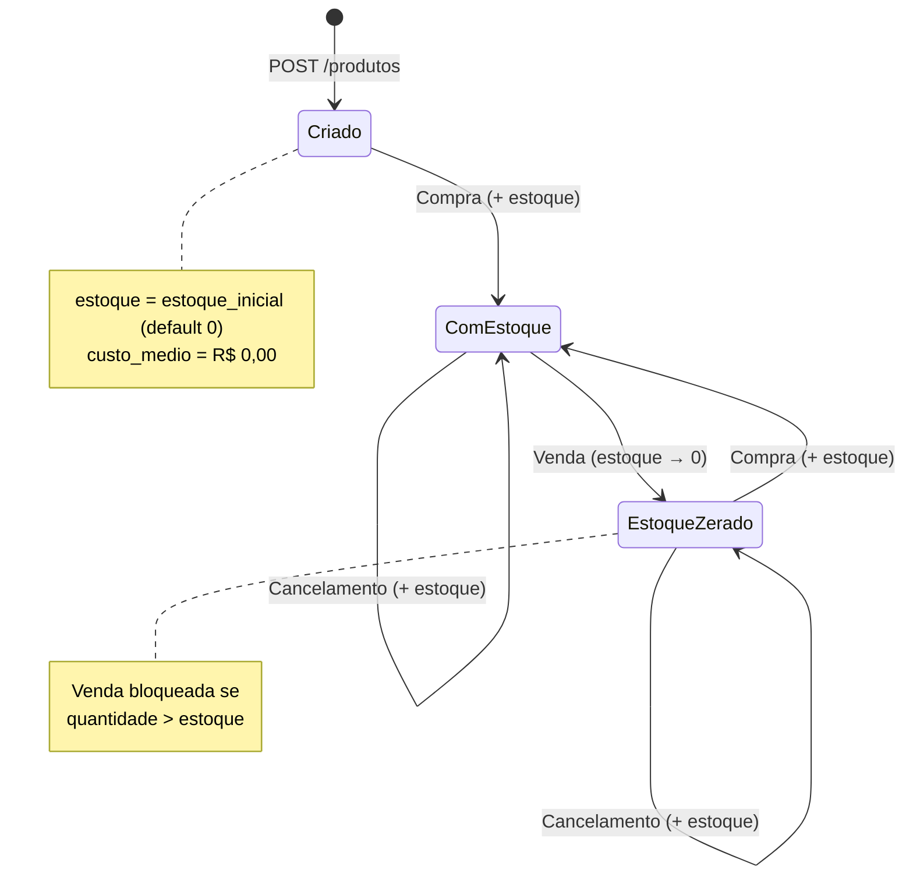
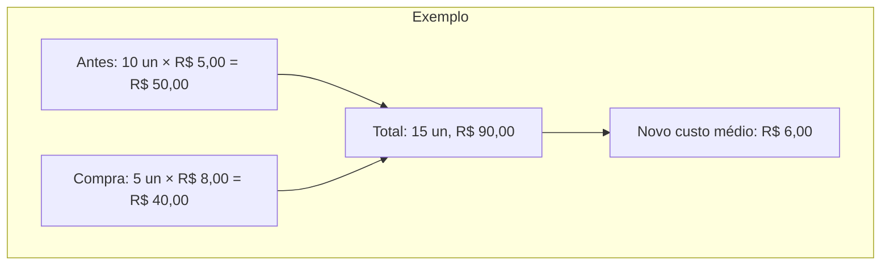
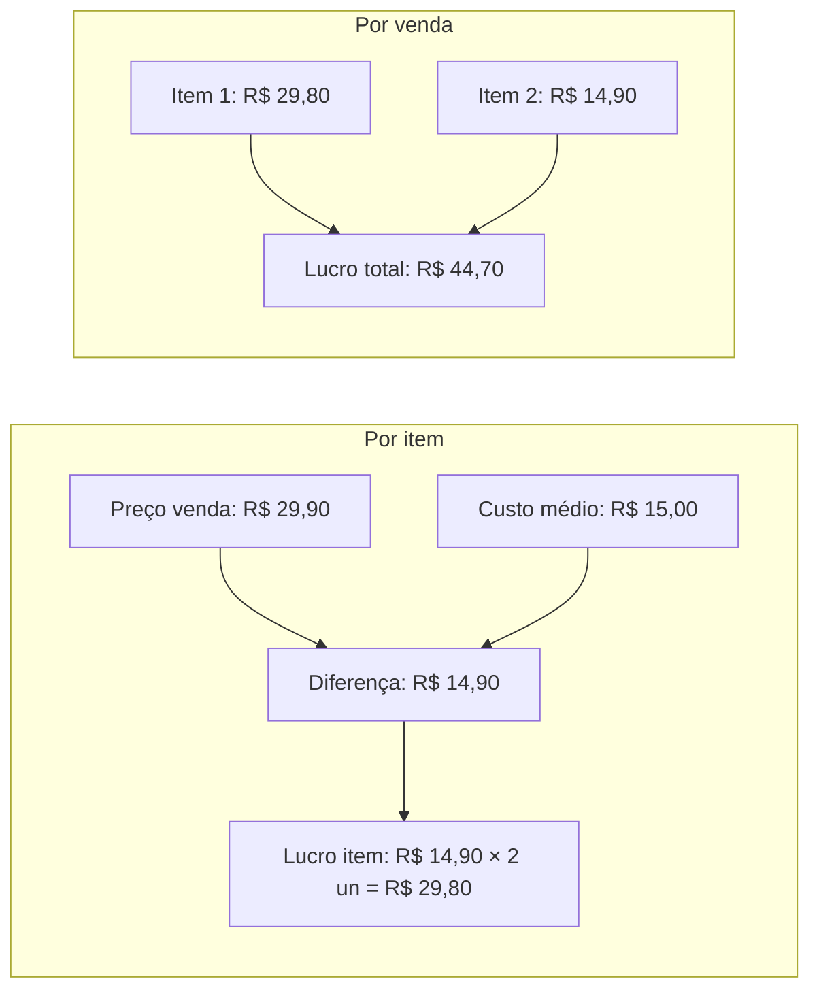
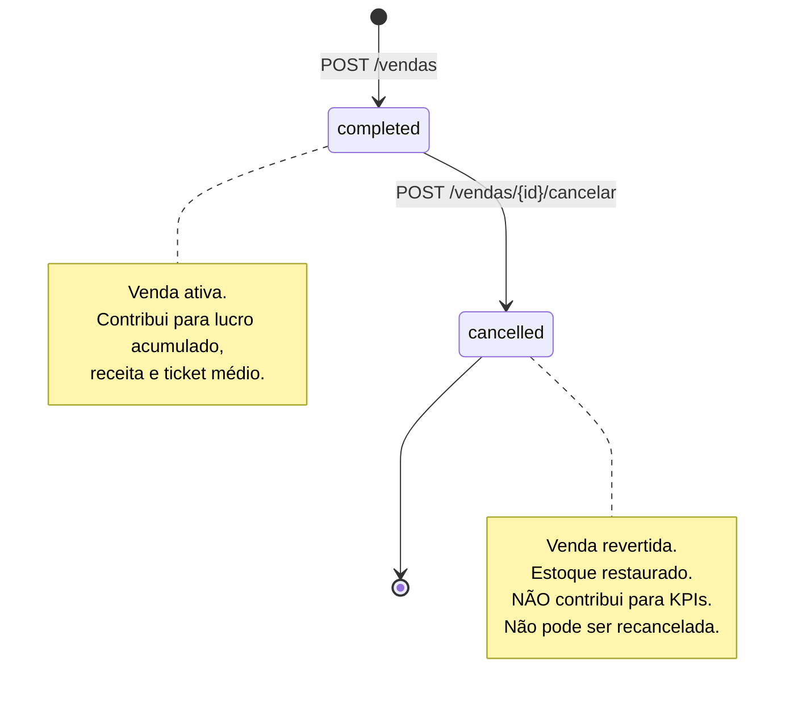
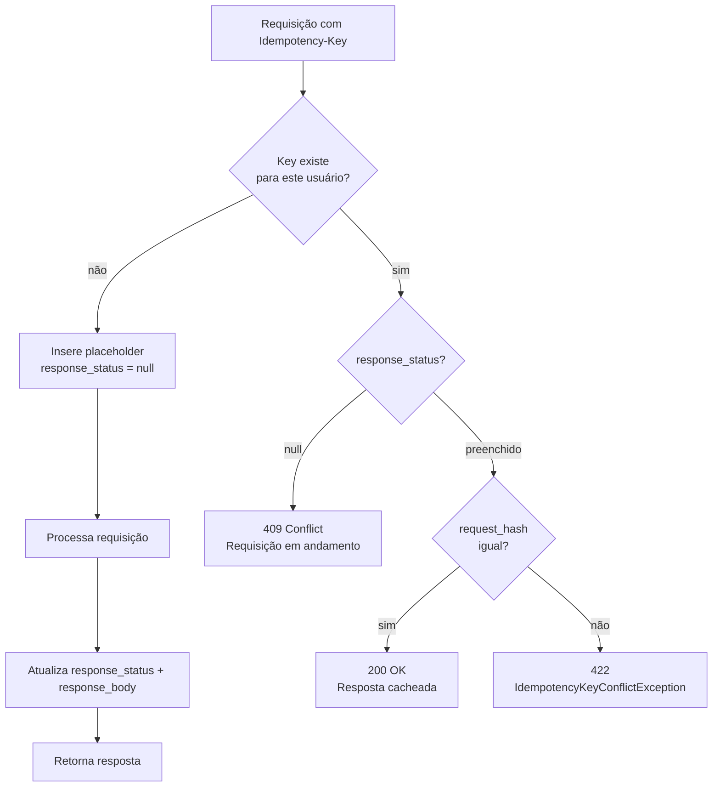
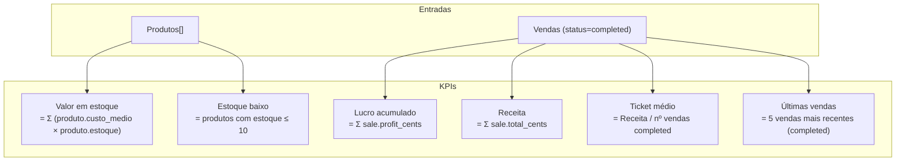

# Regras de Negócio — Fone Ninja ERP de Estoque

## Glossário

| Termo | Definição |
|---|---|
| **Produto** | Item vendável com nome, preço de venda, custo médio e estoque. |
| **Estoque** | Quantidade atual disponível para venda. Altera via Compra (+), Venda (−) ou Cancelamento de venda (+). |
| **Compra** | Transação de entrada de estoque com um Fornecedor, composta por itens (produto + quantidade + preço unitário). Recalcula custo médio. |
| **Venda** | Transação de saída de estoque para um Cliente. Gera lucro. Reversível via Cancelamento. |
| **Cancelamento de venda** | Reversão de uma Venda. Restaura estoque. Status da venda vai para `cancelled`. |
| **Fornecedor** | Parte com quem uma Compra é feita. |
| **Cliente** | Parte para quem uma Venda é feita. |
| **Custo médio** | Custo unitário do produto, recalculado a cada Compra como média ponderada. |
| **Preço de venda** | Preço unitário pelo qual o produto é vendido. |
| **Lucro** | (preço de venda − custo médio) × quantidade, somado por item. |
| **Preview de venda** | Simulação somente-leitura de total e lucro, sem alterar estoque. |
| **Conta** | Pessoa que faz login, com nome, email e senha. |
| **Lucro acumulado** | Lucro total de todas as Vendas não canceladas. |
| **Receita** | Soma dos totais de todas as Vendas não canceladas. |
| **Ticket médio** | Receita ÷ número de Vendas não canceladas. |
| **Valor em estoque** | Σ (custo médio × estoque) de todos os Produtos. |
| **Estoque baixo** | Produto com estoque ≤ 10 unidades. |

---

## Ciclo de Vida do Produto



---

## Compra — Regras

### Entrada

| Campo | Restrição |
|---|---|
| `fornecedor` | Obrigatório, string |
| `produtos` | Array com ≥ 1 item |
| `produtos[].id` | Produto existente, sem duplicatas no mesmo array |
| `produtos[].quantidade` | Inteiro ≥ 1 |
| `produtos[].preco_unitario` | Decimal ≥ 0.01 |

### Efeitos

1. **Estoque**: cada item incrementa `produto.estoque` em `quantidade`
2. **Custo médio**: recalculado via média ponderada para CADA item da compra
3. **Total da compra**: Σ (quantidade × preco_unitario) de todos os itens
4. **Auditoria**: cada item gera um `stock_movement` com `type = purchase_in`

### Cálculo do Custo Médio

```
novo_custo_medio = round(
  (estoque_atual × custo_medio_atual + quantidade_comprada × preco_unitario)
  /
  (estoque_atual + quantidade_comprada)
)
```



### Restrições

- Produtos no array ordenados por `id` ASC antes do processamento (prevenção de deadlock)
- Lock pessimista (`SELECT ... FOR UPDATE`) em cada produto durante a transação
- Transação com 3 tentativas em caso de deadlock

### Idempotência

- Header `Idempotency-Key` obrigatório
- Mesma key + mesmo body → resposta cacheada (200)
- Mesma key + body diferente → 422
- Key em andamento → 409

---

## Venda — Regras

### Entrada

| Campo | Restrição |
|---|---|
| `cliente` | Obrigatório, string |
| `produtos` | Array com ≥ 1 item |
| `produtos[].id` | Produto existente, sem duplicatas no mesmo array |
| `produtos[].quantidade` | Inteiro ≥ 1 |
| `produtos[].preco_unitario` | Decimal ≥ 0.01 |

### Efeitos

1. **Estoque**: cada item decrementa `produto.estoque` em `quantidade`
2. **Custo médio**: NÃO se altera na venda (mantém o valor do momento da venda)
3. **Snapshot do custo**: cada `SaleItem` armazena `average_cost_snapshot_cents` para auditoria
4. **Lucro por item**: (preco_unitario − custo_medio_snapshot) × quantidade
5. **Lucro da venda**: Σ lucro por item
6. **Total da venda**: Σ (quantidade × preco_unitario)
7. **Auditoria**: cada item gera um `stock_movement` com `type = sale_out`

### Cálculo do Lucro



### Restrições

- **Estoque insuficiente**: se `quantidade > produto.estoque` → 422 com mensagem "Estoque insuficiente para o produto `<nome>`"
- Rollback total da transação em caso de erro em qualquer item
- Produtos no array ordenados por `id` ASC
- Lock pessimista em cada produto
- Transação com 3 tentativas

### Idempotência

Mesmo comportamento da Compra.

---

## Preview de Venda — Regras

### Entrada

| Campo | Restrição |
|---|---|
| `produtos` | Array com ≥ 1 item |
| `produtos[].id` | Produto existente, sem duplicatas |
| `produtos[].quantidade` | Inteiro ≥ 1 |
| `produtos[].preco_unitario` | Decimal ≥ 0.01 |

### Comportamento

- **Somente leitura**: sem transação, sem locks, sem escrita no banco, sem eventos
- Calcula total e lucro exatamente como uma venda real faria
- NÃO valida estoque disponível (é uma simulação, não uma operação real)
- Produto inexistente → 404 (ModelNotFoundException)

### Uso

Chamado ao vivo pelo frontend conforme o usuário preenche o formulário de venda (com debounce), exibindo um recibo preview com total e lucro projetados.

---

## Cancelamento de Venda — Regras

### Gatilho

`POST /vendas/{id}/cancelar` — sem Idempotency-Key (operação não repetível por natureza).

### Pré-condições

- Venda deve existir
- Venda deve ter `status = 'completed'`

### Efeitos

1. **Estoque**: cada item da venda incrementa `produto.estoque` em `quantidade`
2. **Status**: `sale.status = 'cancelled'`
3. **Custo médio**: NÃO se altera
4. **Auditoria**: cada item gera um `stock_movement` com `type = sale_cancelled_return`

### Restrições

- Venda já cancelada → 422 com mensagem "Venda já cancelada"
- Não é possível reabrir (cancelar novamente) uma venda cancelada
- Lock pessimista na venda + em cada produto
- Transação com 3 tentativas

### Máquina de Estados da Venda



---

## Regras de Idempotência

Aplica-se a `POST /compras` e `POST /vendas`.



### Regras de conflito

| Cenário | HTTP | Comportamento |
|---|---|---|
| Key nova | 201/200 | Processa e cacheia resposta |
| Key repetida, mesmo body | 200 | Retorna resposta cacheada (sem reprocessar) |
| Key repetida, body diferente | 422 | "Idempotency-Key já utilizada com um corpo de requisição diferente" |
| Key em andamento (race condition) | 409 | Conflito — tente novamente |

### Garantias

- **Unicidade**: `UNIQUE(user_id, key)` no banco
- **Atomicidade**: INSERT do placeholder antes da ação, UPDATE após
- **Hash**: SHA-256 do body para comparação determinística

---

## Custo Médio — Regras Detalhadas

### Quando recalcula

- **Compra**: SEMPRE, para cada item comprado, após incrementar estoque
- **Venda**: NUNCA. O custo médio no momento da venda é capturado como snapshot no `SaleItem`
- **Cancelamento**: NUNCA. O custo médio não se altera ao reverter estoque

### Fórmula

```
CM_novo = round( (E_atual × CM_atual + Q_comprada × P_unitario) / (E_atual + Q_comprada) )
```

Onde:
- `E_atual`: estoque do produto antes da compra
- `CM_atual`: custo médio do produto antes da compra (em centavos)
- `Q_comprada`: quantidade sendo comprada
- `P_unitario`: preço unitário da compra (em centavos)

### Casos de borda

| Cenário | Comportamento |
|---|---|
| Produto novo (estoque 0, custo médio 0) | CM = preco_unitario da compra |
| Compra de 1 unidade | Média ponderada entre estoque existente e a nova unidade |
| Múltiplos itens na mesma compra | Cada item recalcula independentemente, na ordem do array |

### Por que snapshot na venda?

O custo médio pode mudar com Compras futuras. O lucro de uma Venda deve refletir o custo real no momento da transação, não o custo atual. Por isso o `SaleItem` armazena `average_cost_snapshot_cents`.

---

## KPIs do Dashboard — Regras de Cálculo



| KPI | Fórmula | Escopo | Arredondamento |
|---|---|---|---|
| **Lucro acumulado** | Σ `sale.profit_cents` onde `status = 'completed'` | Todas as vendas ativas | 2 casas decimais |
| **Receita** | Σ `sale.total_cents` onde `status = 'completed'` | Todas as vendas ativas | 2 casas decimais |
| **Ticket médio** | Receita ÷ count(vendas completed) | Todas as vendas ativas | 2 casas decimais |
| **Valor em estoque** | Σ `product.average_cost_cents × product.current_stock` | Todos os produtos | 2 casas decimais |
| **Estoque baixo** | count(produtos onde `estoque ≤ 10`) | Threshold fixo: 10 un | Inteiro |
| **Últimas vendas** | Top 5 vendas completed por `created_at DESC` | 5 registros | — |

### Tratamento de borda

- **Zero vendas**: lucro acumulado = R$ 0,00, receita = R$ 0,00, ticket médio = R$ 0,00
- **Vendas canceladas**: ignoradas em todos os KPIs
- **Lucro negativo**: possível se preço de venda < custo médio snapshot

---

## Restrições de Integridade

### Banco de Dados

| Tabela | Coluna | Restrição |
|---|---|---|
| `products` | `sale_price_cents` | `> 0` (CHECK) |
| `products` | `current_stock` | `>= 0` (CHECK) |
| `purchase_items` | `quantity` | `> 0` (CHECK) |
| `purchase_items` | `unit_price_cents` | `> 0` (CHECK) |
| `sale_items` | `quantity` | `> 0` (CHECK) |
| `sale_items` | `unit_price_cents` | `> 0` (CHECK) |
| `idempotency_keys` | `(user_id, key)` | UNIQUE |
| `sales` | `status` | ENUM ('completed', 'cancelled') |
| `stock_movements` | `type` | ENUM ('purchase_in', 'sale_out', 'sale_cancelled_return') |

### Aplicação

| Regra | Onde é garantida |
|---|---|
| Estoque nunca fica negativo | `RegisterSaleAction`: verifica antes de debitar, lança `InsufficientStockException` |
| Venda cancelada não pode ser recancelada | `CancelSaleAction`: verifica `status`, lança `SaleAlreadyCancelledException` |
| Sem duplicatas de produto no mesmo array | `StorePurchaseRequest` / `StoreSaleRequest`: regra `distinct` nos IDs |
| Preços e quantidades positivos | FormRequests: regras `min:0.01` / `min:1` |
| Deadlock prevention | Ordenação de itens por `productId` ASC + `lockForUpdate()` |

---

## Rate Limiting

| Limitador | Escopo | Limite |
|---|---|---|
| `throttle:financial` | Por usuário autenticado (ou IP se guest) | 30 requisições/minuto |

Aplica-se a:
- `POST /compras`
- `POST /vendas`
- `POST /vendas/{id}/cancelar`

---

## Resumo dos Fluxos

```mermaid
flowchart TD
    subgraph "Compra"
        C1["Usuário informa fornecedor + itens"] --> C2["Validação"]
        C2 --> C3["Idempotência"]
        C3 --> C4["Para cada item:<br/>+ estoque<br/>recalcula custo médio"]
        C4 --> C5["Registra stock_movements<br/>(purchase_in)"]
    end

    subgraph "Venda"
        V1["Usuário informa cliente + itens"] --> V2["Validação"]
        V2 --> V3["Idempotência"]
        V3 --> V4["Verifica estoque ≥ quantidade"]
        V4 -->|sim| V5["Para cada item:<br/>− estoque<br/>snapshot custo médio<br/>calcula lucro"]
        V4 -->|não| V6["422: Estoque insuficiente"]
        V5 --> V7["Registra stock_movements<br/>(sale_out)"]
    end

    subgraph "Preview"
        P1["Usuário informa itens"] --> P2["Validação"]
        P2 --> P3["Calcula total + lucro<br/>(sem alterar banco)"]
    end

    subgraph "Cancelamento"
        X1["Usuário seleciona venda"] --> X2["Verifica status = completed"]
        X2 -->|sim| X3["Para cada item:<br/>+ estoque<br/>(sem alterar custo médio)"]
        X2 -->|não| X4["422: Venda já cancelada"]
        X3 --> X5["status = cancelled"]
        X5 --> X6["Registra stock_movements<br/>(sale_cancelled_return)"]
    end
```



---

## Convenções Monetárias

- Todos os valores monetários são armazenados como **centavos inteiros** (`bigint`) no banco
- Na fronteira HTTP, são **strings decimais** (ex: `"99.90"`)
- Arredondamento: `round()` para o centavo mais próximo
- Lucro pode ser negativo (venda abaixo do custo médio)
- Total de compra/venda nunca é negativo (CHECK constraints)
- Custo médio pode ser 0 (produto sem compras)
